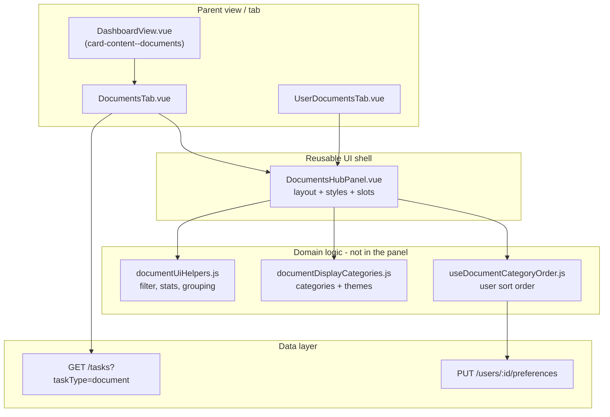

# Modern Hub Panel UI Guide

This document describes how the **Documents** hub UI was built and how to apply the same patterns to other dashboard areas—**Training**, **Payroll**, admin user profiles, and similar “lots of items grouped by category” views.

Use this as the **canonical reference** when adding or redesigning tabs so the product stays visually consistent.

---

## 1. Design goals

| Goal | What it means in practice |
|------|---------------------------|
| **Scannable** | User sees totals, urgent items, and category progress before drilling into rows. |
| **Grouped by meaning** | Sections reflect how people think (Onboarding, Payroll & Tax), not raw database enums. |
| **Action-first** | Primary actions (Sign, Review, Approve) are visible in the row; secondary actions in icon buttons or menus. |
| **Modern, calm density** | White cards on a light gray canvas, soft borders, 10px radius, subtle shadows—not heavy chrome. |
| **Brand anchor** | Forest green (`#166534`) for primary CTAs and accents; category sections get their **own** color families so blocks are distinct. |
| **Reusable shell** | Tab components stay thin; a shared **Hub Panel** owns layout and styling. |

---

## 2. Architecture (how Documents is structured)



### Layer responsibilities

1. **Parent tab** (`DocumentsTab.vue`, `UserDocumentsTab.vue`)
   - Fetch data, handle routing/modals, wire `@action` / `@menu-action`.
   - Pass `tasks`, `loading`, `error`, `mode` (`self` | `admin`) into the hub panel.
   - Use `#header-actions` slot for tab-specific controls (sort, upload, assign).

2. **Hub panel** (`DocumentsHubPanel.vue`)
   - **Presentation only**: header, stat cards, filters, banners, main + sidebar, section cards, table.
   - Scoped CSS with BEM prefix `doc-hub__` (future tabs: `train-hub__`, `pay-hub__`, or shared `hub__` after extraction).

3. **Helpers** (`frontend/src/utils/documentUiHelpers.js`)
   - Pure functions: status labels, filtering, sorting, stats, grouping, “action required” scoring.
   - No Vue dependencies—easy to test and reuse.

4. **Config** (`frontend/src/config/documentDisplayCategories.js`)
   - Category definitions: `id`, `title`, tags, `icon`, `documentTypes`, **`theme`** (colors).
   - Resolution rules (type → category, keywords in title/source).
   - `getCategoryThemeStyle()` for CSS variables on each section.

5. **Composable** (`useDocumentCategoryOrder.js`) — optional per feature
   - User-specific preferences (order), debounced save, localStorage fallback.

---

## 3. Page layout (top → bottom)

Every hub-style tab should follow this **vertical rhythm**:

```
┌─────────────────────────────────────────────────────────────┐
│ HEADER: icon + title + subtitle                             │
│         [optional user chip]     [slot: header-actions]     │
├─────────────────────────────────────────────────────────────┤
│ STAT ROW: 4 cards (grid), each with tinted icon + number    │
├─────────────────────────────────────────────────────────────┤
│ FILTER BAR: search + 2–3 selects + “Clear filters”          │
├─────────────────────────────────────────────────────────────┤
│ OPTIONAL: category organize bar / info banner               │
├─────────────────────────────────────────────────────────────┤
│ ACTION REQUIRED: amber callout (urgent incomplete items)    │
├──────────────────────────────┬──────────────────────────────┤
│ MAIN (≈1fr)                  │ SIDEBAR (300px)              │
│ Collapsible category sections│ Widget: completion ring      │
│   └ table rows               │ Widget: breakdown lists      │
└──────────────────────────────┴──────────────────────────────┘
```

### Canvas vs cards

- **Outer canvas** (dashboard tab): light gray background so white cards pop.
  - Documents: `DashboardView.vue` → `.card-content.card-content--documents` (`#f3f4f6`, reduced padding).
- **Inner cards**: white (`--dh-bg: #ffffff`), `1px solid #e5e7eb`, `border-radius: 10px`, `box-shadow: 0 1px 2px rgba(0,0,0,0.04)`.

Apply the same pattern for Training / Payroll:

```css
/* Example for a new tab in DashboardView.vue */
.card-content.card-content--training {
  background: #f3f4f6;
  padding: 20px 24px 28px;
  border: none;
  box-shadow: none;
}
```

---

## 4. Design tokens (Documents reference)

Define tokens on the **root hub class** (e.g. `.doc-hub { ... }`):

| Token | Value | Usage |
|-------|--------|--------|
| `--dh-green` | `#166534` | Primary buttons, links, clear-filters |
| `--dh-green-dark` | `#14532d` | Primary hover |
| `--dh-green-soft` | `#dcfce7` | Avatars, success tints |
| `--dh-border` | `#e5e7eb` | Card and input borders |
| `--dh-muted` | `#6b7280` | Subtitles, hints, table headers |
| `--dh-bg` | `#ffffff` | Card backgrounds |

**Typography**

- Title: `26px`, `font-weight: 700`, `letter-spacing: -0.02em`
- Section title: `15px`, bold
- Table header: `11px`, uppercase, `letter-spacing: 0.04em`
- Body/table: `14px`

**Stat card icon tints** (rotate for variety)

- Green: `#dcfce7` / `#166534`
- Orange: `#ffedd5` / `#c2410c`
- Purple: `#f3e8ff` / `#7c3aed`

**Status pills** (`.doc-pill`)

- Success: green soft background
- Warning: amber
- Danger: red
- Muted: gray

Reuse these classes or copy the palette when building `train-hub` / `pay-hub`.

---

## 5. Category sections (the “mockup” look)

Each collapsible section is a **card** with:

1. **Left accent border** — `4px solid var(--cat-accent)`
2. **Header row** — chevron, **icon tile** (34×34, rounded, themed background), title, **two pill tags**, progress (`3/5 complete`), document count
3. **Table** — collapsible body with uppercase column headers

### Per-category colors

Categories declare a `theme` object in config:

```js
theme: {
  accent: '#16a34a',      // left border
  icon: '#15803d',        // SVG stroke
  iconBg: '#dcfce7',      // icon tile
  tagBg: '#ecfdf5',       // primary pill
  tagColor: '#166534',
  tagMutedBg: '#dbeafe',  // secondary pill
  tagMutedColor: '#1d4ed8',
}
```

Applied on the section element:

```js
:style="getCategoryThemeStyle(section.id)"
```

Which sets CSS variables: `--cat-accent`, `--cat-icon`, `--cat-icon-bg`, `--cat-tag-bg`, etc.

**Rule for new domains:** every section/group must have a **unique** `theme`—do not reuse the same accent for adjacent categories.

---

## 6. Key UI blocks (implement on every hub tab)

### 6.1 Stat cards

- Grid: `repeat(4, 1fr)` on desktop; stack on small screens.
- Each card: icon box + large number + label + hint line.
- Hints explain the metric (“Action required”, “In last 30 days”).

**Training example metrics:** Modules in progress, Overdue steps, CE hours this year, Completed this month.

**Payroll example metrics:** Next pay date, Pending approvals, YTD gross, Open adjustments.

### 6.2 Filter bar

- Single row, wrap on mobile.
- Search input with left icon, min-width ~200px flex grow.
- Selects: `padding: 10px`, `border-radius: 8px`, `min-width: 130px`.
- “Clear filters” text button in brand green—only visible when filters active.

### 6.3 Action required banner

- Amber gradient background, gold border.
- List top N urgent items (overdue, due within 7 days).
- Inline status pill + primary CTA per row.
- Logic lives in helpers (`getActionRequiredTasks`), not in the panel.

### 6.4 Info banner (dismissible)

- Green tint for neutral tips; use blue/amber for other severities if needed.
- Close control persists for the session (`showInfoBanner` ref).

### 6.5 Sidebar widgets

Fixed width **300px**, stacked widgets:

- Completion ring (SVG stroke-dasharray) + progress bar
- Breakdown list (e.g. by module / pay period)
- Recent activity list with small icons

Keep widgets **optional** (`v-if` when data exists) so empty states stay clean.

### 6.6 Tables inside sections

- Row hover: subtle background (optional).
- Highlight row: amber inset border (`doc-hub__row--highlight`) for deep-linked items.
- Actions column: primary button for incomplete self-serve flows; icon buttons for view/download; kebab menu for admin.

---

## 7. `DocumentsHubPanel` API (template for new panels)

| Prop | Type | Purpose |
|------|------|---------|
| `title` | string | Page heading |
| `subtitle` | string | One line under title |
| `mode` | `'self'` \| `'admin'` | Controls actions/menus |
| `tasks` | array | Row data (rename per domain: `items`, `records`) |
| `loading` | boolean | Shows spinner state |
| `error` | string | Error message |
| `viewOnly` | boolean | Admin read-only |
| `highlightTaskId` | number | Scroll/highlight row |
| `userDisplayName` | string | Admin user context chip |
| `userRoleLabel` | string | Admin role chip |
| `sortKey` | string | Passed to helper sort |
| `allowCategoryReorder` | boolean | Employee category organize UI |
| `categoryOrder` | array | Override order (admin) |
| `infoBannerText` | string | Dismissible tip |

| Event | Payload | Purpose |
|-------|---------|---------|
| `refresh` | — | Parent refetches |
| `action` | `{ type, task }` | sign, view, download, details, … |
| `menu-action` | `{ type, task }` | admin menu items |

| Slot | Purpose |
|------|---------|
| `header-actions` | Sort, Refresh, Upload, etc. |
| `empty` | Custom empty state copy + buttons |

---

## 8. File map (Documents implementation)

| File | Role |
|------|------|
| `frontend/src/components/documents/DocumentsHubPanel.vue` | Layout + all `doc-hub__` styles |
| `frontend/src/components/dashboard/DocumentsTab.vue` | Employee My Documents tab |
| `frontend/src/components/admin/UserDocumentsTab.vue` | Admin user profile documents |
| `frontend/src/utils/documentUiHelpers.js` | Filters, stats, grouping, pills |
| `frontend/src/config/documentDisplayCategories.js` | Categories + themes + resolution |
| `frontend/src/composables/useDocumentCategoryOrder.js` | Saved category order |
| `frontend/src/views/DashboardView.vue` | `card-content--documents` canvas |
| `backend/src/config/documentDisplayCategories.js` | API validation mirror |
| `database/migrations/834_*.sql`, `835_*.sql` | DB columns for category override + order |

---

## 9. Checklist: adding a new hub tab (Training, Payroll, …)

### Planning

- [ ] List **4 stat metrics** that answer “how am I doing?” at a glance.
- [ ] Define **categories** (5–12) with unique `theme` colors and human titles.
- [ ] Define **filters** (search + 2–3 dimensions: status, type, source/period).
- [ ] Define **row actions** for self vs admin vs view-only.
- [ ] Decide if users can **reorder categories** (composable + preferences JSON).

### Implementation

- [ ] Create `*UiHelpers.js` with pure functions (stats, filter, sort, group).
- [ ] Create `*DisplayCategories.js` (or sections config) with themes.
- [ ] Create `*HubPanel.vue`—copy structure from `DocumentsHubPanel`, rename BEM prefix.
- [ ] Create thin tab wrapper that fetches data and handles modals/routes.
- [ ] Add `card-content--<tab>` style on dashboard parent for gray canvas.
- [ ] Mirror allowed IDs on backend if persisting preferences.
- [ ] Use slots for tab-specific header buttons—**do not** fork the whole panel per tab.

### Visual QA

- [ ] Gray canvas, white cards, consistent border radius (10px) and shadows.
- [ ] Primary buttons use forest green; don’t invent a new primary color per tab.
- [ ] Each category/section has distinct accent + icon tile + pills.
- [ ] Stat icons use green / orange / purple rotation.
- [ ] Sidebar doesn’t collapse awkwardly between 1024px and 768px—test responsive grid (`doc-hub__body` stacks; copy media queries from Documents hub).
- [ ] Empty, loading, error, and “no filter matches” states exist.

---

## 10. Suggested mappings for upcoming tabs

### Training (employee / admin)

| Section | Theme hue | Example content |
|---------|-----------|-----------------|
| Onboarding training | Green | New hire modules |
| Required compliance training | Amber | Mandatory courses |
| CE / professional development | Purple | CE credits, certificates |
| Optional / elective | Slate | Nice-to-have modules |
| Completed archive | Gray | Historical (collapsed by default) |

Sidebar: overall completion ring, hours or credits, modules overdue.

### Payroll (employee)

| Section | Theme hue | Example content |
|---------|-----------|-----------------|
| Current pay period | Teal | Timesheet, pending approval |
| Pay stubs | Blue | Historical stubs by period |
| Tax forms | Indigo | W-2, 1099 |
| Deductions & benefits | Purple | Elections, HSA |
| Adjustments / expenses | Orange | Reimbursements, corrections |

Sidebar: next pay date, YTD totals, pending requests.

Use the same **action required** pattern for: unsigned timesheets, rejected entries, missing tax forms.

---

## 11. BEM naming convention

Prefix by feature to avoid CSS collisions until a shared package exists:

| Feature | Prefix | Example |
|---------|--------|---------|
| Documents | `doc-hub__` | `doc-hub__stat-value` |
| Training (proposed) | `train-hub__` | `train-hub__section-head` |
| Payroll | `pay-hub__` | `pay-hub__filters` |
| Submit | `submit-hub__` | `submit-hub__action` |
| My Account | `acct-hub__` | `acct-hub__nav-item` |
| My Schedule | `sched-hub__` | `sched-hub__stat` |

Shared pieces (future refactor):

- `hub__btn`, `hub__btn--primary`, `hub__pill--success`
- Extract to `frontend/src/styles/hub-panel.css` when 3+ tabs duplicate the same rules.

---

## 12. Do / Don’t

### Do

- Keep **fetch and business rules** in the tab or store, not in the hub panel.
- Use **config-driven** sections with theme objects for color consistency.
- Emit **events** upward for navigation, signing, downloads—panel stays dumb.
- Prefer **collapsible sections + table** over endless card lists for 10+ items.
- Show **progress per section** (`completed/total`) in the header.

### Don’t

- Don’t embed API calls inside the hub panel.
- Don’t hardcode category colors in Vue templates—use config + CSS variables.
- Don’t use separate primary colors per tab (stay with `--dh-green` for CTAs).
- Don’t skip the gray canvas—cards on default white dashboard feel flat.
- Don’t create one-off table styles per tab—copy `doc-hub__table` patterns.

---

## 13. Future improvement (optional)

When Training and Payroll hubs exist:

1. Extract **`HubPanelLayout.vue`** with slots: `stats`, `filters`, `main`, `sidebar`.
2. Extract shared CSS to **`hub-panel.css`** (buttons, stats, filters, table, pills).
3. Add Storybook or a `/dev/hub-preview` route with mock data for visual regression.

Until then, **copy `DocumentsHubPanel.vue` as the source of truth** and rename the BEM prefix—faster and keeps parity with production Documents.

**Payroll reference implementation:** `PayrollHubPanel.vue`, `PayrollHubSection.vue`, `MyPayrollTab.vue`, `payrollDisplayCategories.js`, `payrollUiHelpers.js`. Dashboard canvas: `.my-panel--payroll-hub`.

**Submit reference implementation:** `SubmitHubPanel.vue`, `SubmitHubSection.vue`, `SubmitPanelTab.vue`, `submitDisplayCategories.js`. Dashboard canvas: `.my-panel--submit-hub`. Claim submission lives here—not on My Payroll (payroll is history/status).

**My Account reference implementation:** `AccountHubPanel.vue`, `MyAccountTab.vue`, `accountDisplaySections.js`. Dashboard canvas: `.my-panel--account-hub` / `.card-content--account-hub`. Sidebar nav replaces legacy `my-subnav`; nested **My Payroll** keeps `PayrollHubPanel` inside the payroll section.

**My Schedule reference implementation:** `ScheduleHubPanel.vue`, `scheduleDisplayViews.js`. Dashboard canvas: `.card-content--schedule-hub`. Clickable stat cards switch view mode (self / supervisee / employees / skill builders); white `sched-hub__stage` holds toolbar + `ScheduleAvailabilityGrid`. Full-width rail collapse behavior unchanged.

**Cursor rule:** `.cursor/rules/modern-hub-panel-ui.mdc` (applies when editing hub panel files).

---

## 14. Quick reference: primary class names

```
doc-hub                          Root + CSS variables
doc-hub__header                  Title block
doc-hub__stats / doc-hub__stat   Metric cards
doc-hub__filters                 Search + selects
doc-hub__action-required         Urgent items banner
doc-hub__body                    Main + sidebar grid
doc-hub__section                 Category card
doc-hub__section-head            Collapsible header
doc-hub__table                   Data table
doc-hub__sidebar / doc-hub__widget
doc-hub__btn / doc-hub__btn--primary / doc-hub__btn--ghost
doc-pill / doc-pill--success|warning|danger|muted
```

---

*Last updated: 2026-06-01 — reflects Documents hub with categorized sections, per-category themes, action-required banner, and employee category reorder.*
