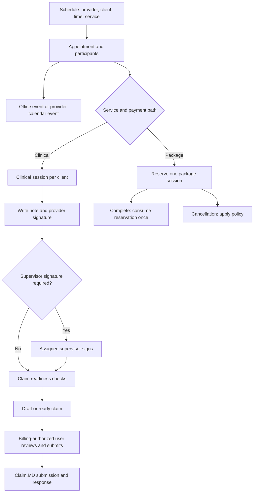

# Scheduling and EHR cutover review

Reviewed September 11–12, 2026. The follow-up changes described below are implemented in this revision. Migrations were exercised in a disposable local MySQL 8.0 database using synthetic records. No application-database migrations, client-data repairs, claim submissions, or deployment were performed.

## Assessment

The application has most of the necessary components, but scheduling has several separate records whose links have not always been maintained. A room reservation, a provider calendar event, an appointment, a clinical session, and a package ledger entry are distinct records. A successful calendar save has therefore not always meant a session was ready for documentation or billing.

This review includes implementation fixes and regression tests. **It is not an end-to-end cutover certification.** The remaining items below include implementation work as well as deployment and agency-specific verification. Do not retire the old EHR on the strength of unit tests alone.

## Intended session lifecycle



Claim preparation and financial access are separate permissions. Providers can document, sign their own notes, and prepare claims. Pricing, financial overrides, claim queues, and Claim.MD submission require billing access. Supervisor-required notes must remain nonbillable until the assigned supervisor signs.

## Implemented changes

| Area | Change |
| --- | --- |
| School and virtual booking | Schedule creation uses the appointment API with clients, service, package, timezone, and recurrence, instead of saving only a calendar event. |
| Clinical linkage | Added appointment-to-clinical-session linkage for sessions without offices, including separate clinical sessions for group participants. The note editor obtains the correct client context before launching Note Aid. |
| Office booking | Context creation now links the canonical appointment as well as the clinical session. Booking requests and recurring plans retain client/service/package context. Core context failures are reported instead of silently presenting a completely successful booking. |
| Billing context | Clinical sessions retain service location, billing office, timezone, and place of service. Office context uses the office timezone. Claim service dates can derive from that timezone. |
| Packages | Entitlement updates lock the entitlement row and consult the appointment ledger. Repeated completion does not deduct twice, cancellation does not release another appointment's reservation, and the legacy practitioner package path does not also debit a selected booking package. |
| Signatures | Draft creation no longer marks provider signoff complete before signing. Signing checks authorship; cosigning checks the assigned supervisor. Independent provider signatures set billability where appropriate. The frontend stops on signing failure. |
| Claim readiness | Checks the actual session/client/agency and a signed, billable, undeleted note. An explicitly invalid note does not silently fall back to a different note. Pending cosignature can produce a draft but cannot pass readiness. |
| Financial permissions | Added server response filtering and financial route gates. Providers can receive agency-specific billing access through the user profile. Affiliated-agency billing encounters are filtered using each encounter's agency permission. |
| Recurrence | Calendar sessions create linked appointments per occurrence, keeping local wall time through daylight-saving transitions. Partial creation reports the IDs already created. |
| Moves | Provider calendar time edits update the linked appointment and clinical session. Moving future office standing assignments preserves existing event and appointment IDs rather than canceling and recreating them. Signed sessions are protected; office-series moves check room and appointment conflicts. |
| Calendar mirroring | The appointment API attempts the provider's existing Google calendar integration and reports a warning if only the local session was saved. No Google events were created during this review. |

## Read-only database findings

The audit queried the databases selected by the backend configuration. These are aggregate counts, not a statement about every deployment or agency. Categories can overlap; do not sum them as unique affected sessions.

| Check | Count | Interpretation |
| --- | ---: | --- |
| Upcoming appointments without an office/calendar link | 1 | Reconcile the intended calendar event before recreating anything. |
| Booked office events with clients but no appointment | 1 | Needs canonical appointment linkage. |
| Booked clinical/school office events without clinical context | 1 | Review classification and establish the appropriate context. |
| Upcoming appointment times differing from their office events | 4 | Determine the authoritative time before repair. |
| Upcoming appointment times differing from provider calendar events | 0 | No mismatch found by this check. |
| Duplicate package consumption per appointment/entitlement | 0 | No duplicates found; this is not a full historical ledger reconciliation. |
| Negative package balances | 0 | No negative balances found. |
| Explicit additional billing memberships | 0 | Choose the intended billing users and grant the agency permission. Admin access is separate. |
| Imported encounters with clients but no clinical session | 0 | Does not establish that all old-EHR clients or encounters have been imported. |
| Signed notes marked nonbillable | 62 | Review by note type and supervision status. Some are intentionally nonbillable; do not bulk-enable billing. |
| Claims linked to a note from another client/session/agency | 0 | No mismatch found by this check. |
| Ready claims missing a signed, billable, undeleted note | 0 | No violations found by this check. |
| New recurring-context schema present | 0 | Main migration below has not been applied. |
| New clinical appointment-link schema present | 0 | Clinical migration below has not been applied. |

Repeat the aggregate audit from `backend/`:

```sh
node src/scripts/verifySchedulingIntegration.js
```

The script uses read-only SQL and prints counts or unavailable-check codes. It does not identify or modify patients and does not repair records. A zero count is only evidence for the specific query shown in the script.

## Remaining work before EHR retirement

1. **Deploy the schema and application together.** Main migration: `database/migrations/1419_recurring_session_context.sql`. Clinical migration: `database/clinical_migrations/015_appointment_clinical_sessions.sql`. They add context storage and appointment/client uniqueness in the clinical plane. The new application paths require these columns. Validate the migrations in staging before rollout; do not start the new booking paths against the old schema.
2. **Reconcile existing records.** Review the orphaned links and four office time mismatches against actual scheduled sessions. Classify the 62 signed/nonbillable notes before taking any billing action. No repair was performed in this review.
3. **Accept the office move workflow in staging.** Providers can drag their own booked office sessions, choose a destination room, and move one occurrence. The office-series option explicitly moves the recurring office slot and **all upcoming sessions**, including those before the selected occurrence; it is not a “from selected date” split. Calendar series continue to offer the existing selected-and-following scope. A single office move preserves IDs and records a skipped original date so rematerialization cannot recreate it. Staff can also move another provider's office series. Conflicts and signed/completed sessions block the move. Confirm the scope labels and permissions with actual staff accounts.
4. **Accept combined video and office bookings in staging.** The frontend creates one canonical appointment per occurrence and one calendar event. Its office request carries the existing appointment or series identity. Approval checks rooms across the entire requested series, then attaches each reservation to that appointment and its existing group encounters; it does not charge the package again. Exact requested durations are preserved. Requests saved before an interrupted linkage can recover their own reserved events on retry. Each unique-session video occurrence uses the appointment-based video endpoint, with a per-appointment lock against duplicate creation. Verify pending/denied office requests and video invitations with representative accounts.
5. **Accept recurring package bookings and cancellations in staging.** Patient plans honor their occurrence count/end date, and canceled/moved positions do not append replacement sessions. Explicit plan booking preflights available package capacity and links/reserves every bounded occurrence before reporting completion. Repeating the same plan excludes its existing reservations from required capacity. Changing the client/package or shortening a series with outstanding booked occurrences requires cancellation of those occurrences first. Calendar and office cancellation paths now invoke appointment cancellation/package policy and release calendar/room facets. Confirm your actual cancellation-policy choices and balances.
6. **Exercise partial-failure recovery.** Main and clinical databases remain separate. A clinical synchronization failure after a room move returns affected IDs and an explicit error. Plan finalization and room approval expose partial completion; retry the same plan/request rather than creating a new booking. Main office-appointment linkage and video room creation use advisory locks to reduce duplicate creation. This is not a general distributed transaction or durable retry queue: outage recovery and reminder/Google synchronization still require operational acceptance testing. Existing historical records still require the reconciliation in item 2.
7. **Verify the actual import.** Identify the retiring EHR and first agency, obtain a representative export, map stable external IDs, reconcile client/provider assignments and insurance, and test repeated imports without duplication. Neither a real export nor that source system was supplied during this review.
8. **Run the live billing handoff in staging.** Use an ordinary provider, a supervised provider, a billing-enabled provider, and a billing-team account. Verify preparation without financial visibility, signature/cosignature, accurate service date/location/codes, billing review, Claim.MD submission, acknowledgement/rejection handling, and duplicate-submit protection. No external claim was sent or clearinghouse configuration certified here.

## Existing import and EHR-sync facilities

The repository already contains billing-report uploads and ingestion, client demographics import, intake-note import, and encounter-to-clinical-session conversion. Relevant starting points are `backend/src/services/billingReportIngest.service.js`, `backend/src/services/billingEncounterClinical.service.js`, and the client import routes. These provide a foundation for migration, but their presence does not establish compatibility with an unknown EHR export or completeness of insurance, authorizations, historical claims, documents, package balances, or future appointments.

The external-calendar reconciliation path currently audits missing overlap rather than automatically downgrading a booked session solely because it disappeared from the old EHR feed. That reduces one cutover hazard. Still explicitly check feed configuration, calendar duplication, future appointments, reminders, and responsibilities during the transition.

## Validation performed

- 57 backend regression tests passed across clinical linkage, package accounting, settlement, financial access, claim readiness, calendar synchronization, recurrence, office-series moves, package-plan finalization, and office/appointment binding.
- 7 additional integration tests passed against disposable MySQL 8.0: both migrations, clinical uniqueness, record-preserving moves, conflict rollback, signed-note protection, series date preservation, and concurrent reservation/completion of the last package session. These use representative synthetic tables, not a restored production schema.
- 12 targeted frontend tests passed for appointment editor configuration, event instants, and the Note Aid view smoke test.
- Frontend production build passed with an 8 GB Node heap. The default 4 GB heap ran out of memory; existing chunk-size warnings remain.
- JavaScript syntax and scoped whitespace checks were run for the scheduling changes.
- The original read-only application-database audit above completed. Its historical counts were not re-audited in the follow-up. No browser-driven end-to-end session, actual EHR import, or real Claim.MD submission was performed.

Backend regression command, from `backend/`:

```sh
../frontend/node_modules/.bin/vitest run --config vitest.scheduling.config.js
```

Frontend validation, from `frontend/`:

```sh
npm test -- src/components/schedule/__tests__/appointmentEditorShared.test.js src/utils/__tests__/scheduleEventInstants.test.js src/views/admin/__tests__/ClinicalNoteGeneratorView.smoke.test.js
NODE_OPTIONS=--max-old-space-size=8192 npm run build
```

The optional MySQL integration test uses `SCHEDULING_TEST_MYSQL_PORT` to connect only to localhost with synthetic data. It creates two fixed `codex_scheduling_validation_*` databases, refuses to adopt existing databases with those names, and drops only the databases it created. It does not load backend/.env. Run it against a disposable MySQL container, not an application database.

```sh
SCHEDULING_TEST_MYSQL_PORT=<disposable-local-port> ../frontend/node_modules/.bin/vitest run --config vitest.scheduling.config.js src/services/__tests__/scheduling.mysql.test.js
```

The workspace's earlier scheduling changes were committed separately while this follow-up was underway. No unrelated work was reverted, and this follow-up did not create a commit.

## Cancellation workflow review — September 12 mockups

The existing `AppointmentChangeWizard.vue` already follows Event → Details → Consequence → Review & Sign. Inspection found that Save Draft discarded selections, Sign wrote an unsigned general `ClientNotes` message instead of a session note, note-write errors were swallowed, optional service-code overrides could create secondary claims, and void/reschedule/no-show paths did not consistently release calendar occupancy. Package preview queried nonexistent unified-package columns and could select an unrelated legacy entitlement.

Local corrections in this follow-up:

- Migration `1424_appointment_change_workflows.sql` persists drafts, frozen signing decisions, signed narratives, and result/note links. Reopening Change appointment retrieves the draft or signed session note. A signature attestation is required; retry resumes the original decision instead of creating another note.
- Clinical cancellation notes are `APPOINTMENT_CHANGE` records attached to all affected appointment/office clinical sessions, with signer, timestamp, content hash, existing payload-encryption handling, and `is_billable = 0` in the same clinical transaction. Office record references are populated. Nonclinical/package appointments retain their signed note on the appointment workflow without inventing a medical encounter.
- Removed secondary-claim creation from this workflow. Clinical session status and claim block are set before consequences; explicit claim creation and readiness also reject non-occurring sessions. Context refresh preserves the cancellation block and cannot settle a waived no-show again. Existing signed service documentation and completed appointments require a separate correction review; this workflow does not silently replace them.
- Cancellation, reschedule, void, and no-show release reminders/calendar occupancy. The workflow applies the chosen package consequence once rather than invoking both automatic settlement and another free-miss debit. Practitioner missed-session ledger/balance writes now share a transaction and entitlement lock. Provider-caused changes and approved waivers release reservations without a client charge. Financial amounts are absent from generated provider-facing prose.
- Corrected unified-package schema lookups; clinical bookings no longer fall back to an unrelated tutoring package. Existing practitioner free-rebook policy is previewed and applied to the same entitlement. Replacement appointments are selected by date/title and validated against the same client and agency. Rescheduling requires a booked replacement, preserving the original appointment and note. Notice calculations interpret stored appointment times as UTC.

Gaps identified during the initial cancellation review (updated by the continuation below):

- The waiver-review queue and post-signature restoration gap was addressed in the continuation below. Recommendations remain pending until an authorized reviewer signs a decision.
- The unified package hierarchy was added in the continuation below. Legacy practitioner packages retain their existing free-rebook/forfeit rules, with restoration support; the new bonus allowance configuration lives in the unified package catalog.
- The replacement picker links an already-booked session; creating/moving the replacement occurs in the schedule.
- Separate main/clinical databases still require resumable steps rather than a distributed transaction. The workflow returns an error on failed required writes and preserves partial signing state for the same signer to resume. Actual agency-policy and ClaimMD staging acceptance remains necessary.

Validation: regression tests cover draft persistence, explicit signature, completed-note read-only display, same-client replacement selection, provider waiver restrictions, no duplicate settlement, failed writes/retries, nonbillable signed clinical notes, and blocked claim inserts. Disposable MySQL tests applied migration 1424 and exercised signed-note retry/claim blocking plus concurrent practitioner free-miss consumption. No application database migrations, real client changes, claim submissions, or deployment were performed.

Final verification for this follow-up: 88 backend checks (including 10 disposable MySQL tests), 13 frontend checks, and the frontend production build passed. The temporary MySQL container was stopped and removed.


## Waiver review and package allowances — September 12 continuation

- Signing with a waiver recommendation now creates a durable review request. Existing completed recommendations are backfilled by migration `1425_appointment_waivers_and_package_credits.sql`. The schedule includes an organization-scoped Appointment waiver reviews queue with pagination, signed-note review, mandatory decision reason and signature, and approve/deny actions. Billing access is checked on the server; providers with the additional agency billing permission can review, and ordinary providers cannot access the queue or its fee amounts.
- Approval restores the exact consumed free-miss, bonus, or paid credit, or waives an unpaid missed-appointment fee. Denial retains the original consequence. Original signed notes remain unchanged; each decision writes a separate signed, nonbillable `APPOINTMENT_WAIVER` addendum and office note reference. The original signer and reason remain fixed on retries.
- Main-database adjustments and review decisions commit together under appointment and entitlement locks. If clinical storage fails afterward, the queue shows documentation pending and resumes the same decision without another balance adjustment. Neither decision creates an insurance claim or clears the non-occurring session’s claim block.
- Unified entitlements now track free misses and bonus available/reserved balances. Bonus counters are subsets of total session balances. Reservation and completion track their credit source; missed sessions consume a free miss first, then a bonus credit available to that appointment, then a paid credit. A reservation owned by another appointment cannot be consumed. Ledger snapshots preserve the actual applied consequence when balance availability changes after preview.
- Package catalog settings configure included free misses, bonus sessions, and missed fees for new purchases. Activation grants allowances once. Existing entitlements retain their balances; there is no retroactive grant based on edited catalog settings. Catalog cancellation rules now participate in package-policy resolution while explicit appointment/package overrides retain precedence. A retain-credit policy releases the reservation; a configured fee policy charges the missed fee while retaining credit.
- Practitioner free misses and missed-session debits can also be restored on approval using their original ledger entries. New bonus-bucket configuration is for unified booking packages; this does not migrate legacy entitlements automatically.

Operational limits: a fee already paid or invoiced requires its refund/credit to be resolved in billing; the waiver action leaves payment history and the request intact. A historical manual-fee policy with no fee amount needs catalog configuration before automatic completion. Replacement booking remains in the schedule. Agency policy acceptance, EHR import rehearsal, migration deployment, and ClaimMD staging acceptance are still required before go-live. No application database or live claim was changed during this work.

Continuation validation: 112 distinct backend checks passed (including 19 disposable MySQL checks), 23 frontend checks passed, and the frontend production build completed. The full backend run passed 111 checks; the additional administrator-waiver preview regression and its affected suite passed afterward. The disposable MySQL container was stopped and removed. No commit or deployment was made.

### Provider and agency self-pay rates — September 12 follow-up

- Admin/superadmin can open **Provider profile → Billing** to set a separate self-pay override for each service, switch to agency defaults, or manage agency rates from **Settings → General → Booking & service types**. Other roles, including providers with delegated billing access, cannot read or write this configuration API. Actor and target provider agency memberships are checked independently.
- The provider sheet follows explicitly granted/default practice categories and existing service assignments. A counselor does not receive tutoring rates through the legacy all-category fallback. Configure practice categories on the Account tab when a provider has none. Services such as Couples Counseling and Family Counseling can be separate catalog entries and carry independent rates even if their clinical code is shared; use **Add service** in Booking & service types for additional offerings.
- Each service supports USD per session or per hour. Provider override → agency self-pay default → legacy catalog price is the precedence. Clearing an override restores inheritance; zero remains an explicit free service. Hourly prices are prorated to the booked duration and rounded to cents. New appointments copy the resolved charge; changing a rate does not rewrite existing appointments. These are whole-appointment rates, not per-participant group charges.
- Purchased packages retain their terms and balances. Clinical counseling packages retain a clinical note context with insurance claims blocked; tutoring/coaching packages stay in their nonclinical workflow. Booking against a selected package reserves its credit without adding the standalone service charge. The Billing page links to the existing package catalog; provider-specific package price overrides are not added in this change.
- An explicit **self-pay and packages only** agency option routes new clinical appointments to self-pay settlement while retaining their clinical note context. Insurance coding validation is skipped for these appointments, and claim creation/readiness remain blocked. Office context refresh and medical billing edits preserve that block. Existing appointments retain their prior billing arrangement; switching the agency setting is not a historical conversion.
- Public finder display rates remain separate from the new per-service fee schedules. Their write paths, and legacy catalog price writes, now require admin/superadmin as well. The profile Billing page implements the rate-management portion of the mockup; it does not fabricate revenue, claim, payout, or payroll dashboard metrics.
- Apply main migration **1429_self_pay_service_rates.sql** before deploying this version. It creates separate rate/settings tables and does not change existing rates or enable self-pay-only automatically. The earlier scheduling migrations (1419, 1424, 1425 and clinical 015) remain deployment prerequisites.

Validation for this follow-up includes rate precedence and zero/inheritance, role and tenant isolation, practice filtering, hourly calculations, booking snapshots and package separation, clinical self-pay settlement/claim blocks, Vue rate editing/access/load failure tests, and migration/quote/claim checks against disposable MySQL 8.0. The production frontend build passes. No production database, client billing, or live ClaimMD submission was changed.

Final local validation: 136 backend checks (including 21 disposable MySQL checks), 27 frontend checks, and the production frontend build passed. Deployment migrations and staging acceptance remain outstanding.
