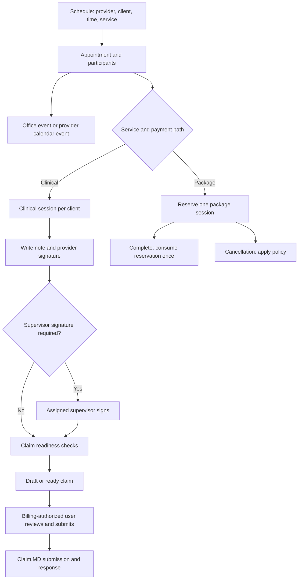

# Scheduling and EHR cutover review

Reviewed September 11, 2026. Changes are in the working tree. No migrations, live data repairs, claim submissions, or deployment were performed.

## Assessment

The application has most of the necessary components, but scheduling has several separate records whose links have not always been maintained. A room reservation, a provider calendar event, an appointment, a clinical session, and a package ledger entry are distinct records. A successful calendar save has therefore not always meant a session was ready for documentation or billing.

This review includes implementation fixes and regression tests. **It is not an end-to-end cutover certification.** The remaining items below include implementation work as well as deployment and agency-specific verification. Do not retire the old EHR on the strength of unit tests alone.

## Intended session lifecycle



Claim preparation and financial access are separate permissions. Providers can document, sign their own notes, and prepare claims. Pricing, financial overrides, claim queues, and Claim.MD submission require billing access. Supervisor-required notes must remain nonbillable until the assigned supervisor signs.

## Implemented changes

| Area | Change |
| --- | --- |
| School and virtual booking | Schedule creation uses the appointment API with clients, service, package, timezone, and recurrence, instead of saving only a calendar event. |
| Clinical linkage | Added appointment-to-clinical-session linkage for sessions without offices, including separate clinical sessions for group participants. The note editor obtains the correct client context before launching Note Aid. |
| Office booking | Context creation now links the canonical appointment as well as the clinical session. Booking requests and recurring plans retain client/service/package context. Core context failures are reported instead of silently presenting a completely successful booking. |
| Billing context | Clinical sessions retain service location, billing office, timezone, and place of service. Office context uses the office timezone. Claim service dates can derive from that timezone. |
| Packages | Entitlement updates lock the entitlement row and consult the appointment ledger. Repeated completion does not deduct twice, cancellation does not release another appointment's reservation, and the legacy practitioner package path does not also debit a selected booking package. |
| Signatures | Draft creation no longer marks provider signoff complete before signing. Signing checks authorship; cosigning checks the assigned supervisor. Independent provider signatures set billability where appropriate. The frontend stops on signing failure. |
| Claim readiness | Checks the actual session/client/agency and a signed, billable, undeleted note. An explicitly invalid note does not silently fall back to a different note. Pending cosignature can produce a draft but cannot pass readiness. |
| Financial permissions | Added server response filtering and financial route gates. Providers can receive agency-specific billing access through the user profile. Affiliated-agency billing encounters are filtered using each encounter's agency permission. |
| Recurrence | Calendar sessions create linked appointments per occurrence, keeping local wall time through daylight-saving transitions. Partial creation reports the IDs already created. |
| Moves | Provider calendar time edits update the linked appointment and clinical session. Moving future office standing assignments preserves existing event and appointment IDs rather than canceling and recreating them. Signed sessions are protected; office-series moves check room and appointment conflicts. |
| Calendar mirroring | The appointment API attempts the provider's existing Google calendar integration and reports a warning if only the local session was saved. No Google events were created during this review. |

## Read-only database findings

The audit queried the databases selected by the backend configuration. These are aggregate counts, not a statement about every deployment or agency. Categories can overlap; do not sum them as unique affected sessions.

| Check | Count | Interpretation |
| --- | ---: | --- |
| Upcoming appointments without an office/calendar link | 1 | Reconcile the intended calendar event before recreating anything. |
| Booked office events with clients but no appointment | 1 | Needs canonical appointment linkage. |
| Booked clinical/school office events without clinical context | 1 | Review classification and establish the appropriate context. |
| Upcoming appointment times differing from their office events | 4 | Determine the authoritative time before repair. |
| Upcoming appointment times differing from provider calendar events | 0 | No mismatch found by this check. |
| Duplicate package consumption per appointment/entitlement | 0 | No duplicates found; this is not a full historical ledger reconciliation. |
| Negative package balances | 0 | No negative balances found. |
| Explicit additional billing memberships | 0 | Choose the intended billing users and grant the agency permission. Admin access is separate. |
| Imported encounters with clients but no clinical session | 0 | Does not establish that all old-EHR clients or encounters have been imported. |
| Signed notes marked nonbillable | 62 | Review by note type and supervision status. Some are intentionally nonbillable; do not bulk-enable billing. |
| Claims linked to a note from another client/session/agency | 0 | No mismatch found by this check. |
| Ready claims missing a signed, billable, undeleted note | 0 | No violations found by this check. |
| New recurring-context schema present | 0 | Main migration below has not been applied. |
| New clinical appointment-link schema present | 0 | Clinical migration below has not been applied. |

Repeat the aggregate audit from `backend/`:

```sh
node src/scripts/verifySchedulingIntegration.js
```

The script uses read-only SQL and prints counts or unavailable-check codes. It does not identify or modify patients and does not repair records. A zero count is only evidence for the specific query shown in the script.

## Remaining work before EHR retirement

1. **Deploy the schema and application together.** Main migration: `database/migrations/1419_recurring_session_context.sql`. Clinical migration: `database/clinical_migrations/015_appointment_clinical_sessions.sql`. They add context storage and appointment/client uniqueness in the clinical plane. The new application paths require these columns. Validate the migrations in staging before rollout; do not start the new booking paths against the old schema.
2. **Reconcile existing records.** Review the orphaned links and four office time mismatches against actual scheduled sessions. Classify the 62 signed/nonbillable notes before taking any billing action. No repair was performed in this review.
3. **Finish office occurrence and provider move workflows.** The improved standing-assignment move remains a schedule-manager action. A consistent provider self-service flow for moving one office occurrence, requesting a different room, and moving all future occurrences still needs wiring and acceptance testing. Do not assume the calendar-only move path is an office reservation move.
4. **Unify combined video-plus-office bookings.** That branch still coordinates separate office-request, appointment, calendar, and video operations. Its appointment adoption, pending office approval, group participants, and recurring video-room creation need integration work. Recurring video-only calendar appointments are created, but individual future video rooms have not been verified.
5. **Finish recurring office package reservation.** Plans retain package selections, but future materialized office slots obtain canonical/clinical context lazily. Booking a complete office series must preflight and reserve the selected package across its occurrences, handle insufficient capacity explicitly, and release reservations consistently when the series is canceled. Calendar-created package series reserve per occurrence; the office-plan path is not equivalent yet.
6. **Harden cross-record changes.** Main and clinical databases do not share a transaction. Office moves report clinical synchronization failure after the main transaction commits. Direct appointment time patches, provider-calendar cancellation, and office-series cancellation need integration coverage for room occupancy, reminders, all related records, and package release. Series edits and booking retries need a durable retry/reconciliation strategy; a reported partial save must not be retried as a brand-new booking blindly.
7. **Verify the actual import.** Identify the retiring EHR and first agency, obtain a representative export, map stable external IDs, reconcile client/provider assignments and insurance, and test repeated imports without duplication. Neither a real export nor that source system was supplied during this review.
8. **Run the live billing handoff in staging.** Use an ordinary provider, a supervised provider, a billing-enabled provider, and a billing-team account. Verify preparation without financial visibility, signature/cosignature, accurate service date/location/codes, billing review, Claim.MD submission, acknowledgement/rejection handling, and duplicate-submit protection. No external claim was sent or clearinghouse configuration certified here.

## Existing import and EHR-sync facilities

The repository already contains billing-report uploads and ingestion, client demographics import, intake-note import, and encounter-to-clinical-session conversion. Relevant starting points are `backend/src/services/billingReportIngest.service.js`, `backend/src/services/billingEncounterClinical.service.js`, and the client import routes. These provide a foundation for migration, but their presence does not establish compatibility with an unknown EHR export or completeness of insurance, authorizations, historical claims, documents, package balances, or future appointments.

The external-calendar reconciliation path currently audits missing overlap rather than automatically downgrading a booked session solely because it disappeared from the old EHR feed. That reduces one cutover hazard. Still explicitly check feed configuration, calendar duplication, future appointments, reminders, and responsibilities during the transition.

## Validation performed

- 38 backend regression tests passed across clinical linkage, package accounting, settlement, financial access, claim readiness, calendar synchronization, recurrence, and office-series moves.
- 12 targeted frontend tests passed for appointment editor configuration, event instants, and the Note Aid view smoke test.
- Frontend production build passed with an 8 GB Node heap. The default 4 GB heap ran out of memory; existing chunk-size warnings remain.
- JavaScript syntax and scoped whitespace checks were run for the scheduling changes.
- The read-only database audit above completed. Migrations were not applied, and no browser-driven end-to-end session, import, or real Claim.MD submission was performed.

Backend regression command, from `backend/`:

```sh
../frontend/node_modules/.bin/vitest run --config vitest.scheduling.config.js
```

Frontend validation, from `frontend/`:

```sh
npm test -- src/components/schedule/__tests__/appointmentEditorShared.test.js src/utils/__tests__/scheduleEventInstants.test.js src/views/admin/__tests__/ClinicalNoteGeneratorView.smoke.test.js
NODE_OPTIONS=--max-old-space-size=8192 npm run build
```

The workspace also contains unrelated concurrent changes. They were not reverted or included in the scope of this review.
