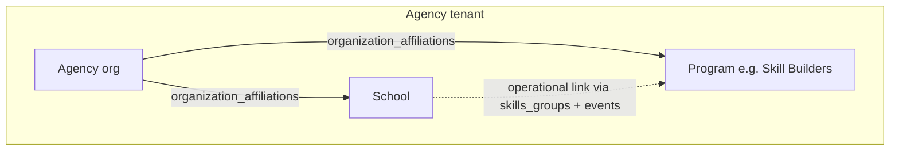

# Skill Builders program, school linkage, and cross–sub-organization affiliations

Living document for the **Skill Builders overhaul**: how we connect programs and schools under an agency, what shipped in code, and how to extend the pattern later.

## Why this doc exists

Several features converged:

- **Sub-coordinator My Dashboard**: one card per non-school affiliated org (e.g. program “Skill Builders”) with a hub (Availability, program-scoped Events, Work schedule).
- **Skill Builder–eligible providers**: a **Skill Builders** hub on My Dashboard (same three tabs as coordinators where applicable) scoped to their assignments, plus calendar overlay entry point.
- **School portal “Skill Builders”** (formerly framed as generic skills groups): time-bounded groups with meetings, providers, and clients—now tied to the **Skill Builders program org** and **integrated `company_events`**.
- **Broader direction**: we are effectively modeling **relationships between sub-organizations** under a parent agency (not only school ↔ agency). This document names that pattern so future work (program ↔ program, learning ↔ school, etc.) can reuse or generalize it.

## Eligibility vs affiliation

| Concept | Meaning |
|--------|---------|
| **`organization_affiliations`** | Structural link: school/program/learning org ↔ parent **agency** tenant. |
| **`users.skill_builder_eligible`** | Product flag: this user may use **Skill Builders** surfaces (hub, scoped roster option, availability). It is **not** a separate org-affiliation row; it gates UX and APIs. |
| **`users.has_skill_builder_coordinator_access`** | May open **coordinator** hubs per affiliated program org and use admin-style Event Management listings for that program. |

When `skill_builder_eligible` is true, providers may restrict the main **client list** to **Skill Builders event participants** using `GET /api/clients?skillBuildersOnly=true` (same agency membership rules apply). Providers may also use **My roster → Skill Builders clients only** (`GET /api/school-portal/:orgId/my-roster?skillBuildersOnly=true`) when eligible.

## Conceptual model

- **`organization_affiliations`**: canonical “child org affiliated to parent agency” (existing product model).
- **Skill Builders ↔ school (current slice)**: in addition to each being affiliated to the agency, we record an **operational** link when a **skills group** exists at a school:
  - Rows in `skills_groups` (school as `organization_id`, `agency_id` = parent agency).
  - Resolver finds the **program** org named **Skill Builders** under that agency.
  - A **program-scoped** `company_events` row (`organization_id` = program) is created/updated/deactivated with the group (integrated “event” for Event Management / sub-coordinator hubs).

So: **the school portal UI is the place where “Skill Builders shows up at this school” is created and maintained**; the integrated company event is the cross-program visibility and scheduling artifact.

## Naming constraint: “Skill Builders” program

Program resolution today is **by name** (case-insensitive, trimmed): affiliated `organization_type = program` whose name is **Skill Builders**.

- **Do not rename** that organization in production without updating code or adding a configurable override (e.g. `feature_flags.skillBuildersProgramOrganizationId` has been discussed as a future mitigation).
- Treat the string as a **stable product identifier** until a flag-based id exists.

## Product mapping (words users see)

| User-facing idea | Where it lives |
|------------------|----------------|
| Skill Builders at a school / after-school program | School portal **Skill Builders** section; `skills_groups` at the **school** `organization_id` |
| “Events” for that program (directory / coordinator) | `company_events` with `organization_id` = Skill Builders program; admin **Company events** can attach `organizationId`; hub **Events** tab lists by program |
| Skill Builder–eligible providers | `users.skill_builder_eligible`; picker and **new** provider adds enforce eligibility; existing assignments may predate the rule (grandfathered) |
| Provider **Skill Builders** hub (My Dashboard) | Rail card → modal: **Availability** (manage own + link to full modal), **Events** (assigned + upcoming apply), **Work schedule** (availability + meetings + events; same data as calendar overlay) |
| **Event portal** | Authenticated route under org slug; school-portal–style card layout; role-based cards (guardian vs assigned provider vs staff/coordinator); weekly meetings + team Skill Builder availability; roster; comments; kiosk clock in/out → payroll staging |
| **Public** agency / program events | Public routes listing upcoming `company_events` (no PHI) |

### Event portal UX and roles

- **Shared shell**: [`SkillBuildersEventPortalLayout.vue`](../frontend/src/components/skillBuilders/SkillBuildersEventPortalLayout.vue) aligns staff ([`SkillBuildersEventPortalView.vue`](../frontend/src/views/skillBuilders/SkillBuildersEventPortalView.vue)) and guardian ([`GuardianSkillBuildersEventView.vue`](../frontend/src/views/guardian/GuardianSkillBuildersEventView.vue)) with a common header + responsive card grid (similar feel to the school portal).
- **Guardian**: Children, schedule, providers, discussion (read-focused); chat sidebar unchanged.
- **Assigned provider** (`skills_group_providers`): **My work schedule** ([`SkillBuildersWorkSchedulePanel.vue`](../frontend/src/components/availability/SkillBuildersWorkSchedulePanel.vue)), optional **Weekly meeting pattern** read-only, kiosk when applicable, roster restricted by `active_for_providers` when not staff/coordinator.
- **Agency staff / support / admin / super_admin** or **`has_skill_builder_coordinator_access`**: **Program week pattern** editor ([`SkillBuildersEventProgramMeetingsCard.vue`](../frontend/src/components/skillBuilders/SkillBuildersEventProgramMeetingsCard.vue)), **Team schedules** ([`SkillBuildersEventTeamScheduleCard.vue`](../frontend/src/components/skillBuilders/SkillBuildersEventTeamScheduleCard.vue)) to view/edit roster providers’ `provider_skill_builder_availability` (6+ hrs/week rules), full roster, **Edit event** when `canManageCompanyEvent`. **`school_staff`** cannot post to event discussion posts (`canPostEventDiscussion` false); API already enforces via `assertEventDiscussionAccess`.

**APIs**

- `GET /api/skill-builders/events/:eventId/detail` — includes `meetings` for the linked skills group and `viewerCapabilities`: `isAssignedProvider`, `canManageTeamSchedules`, `canManageCompanyEvent`, `showKioskClockActions`, `canPostEventDiscussion` (top-level flags remain for backward compatibility). For legacy integrated `skills_group` rows whose `starts_at` still uses the old **UTC noon** anchor (or timezone is UTC), `event` + `calendar` are **display-adjusted** to the canonical window from `skills_groups` dates and the agency office timezone so the portal matches the weekly meeting pattern.
- `GET /api/skill-builders/events/:eventId/company-event-edit?agencyId=` and `PUT /api/skill-builders/events/:eventId/company-event-edit` (body includes `agencyId`) — staff/coordinator with event access; same company-event fields as agency admin `PUT /api/agencies/:id/company-events/:eventId` (Skill Builders event portal edit modal). **GET** also returns `skillsGroupMeetings: [{ weekday, startTime, endTime }]` when the event is linked to a skills group, so the modal can show the program week pattern (recurring slots live in `skills_group_meetings`, not `company_events.recurrence_json`). Integrated `skills_group` company events get `timezone` + start/end instants from the agency’s first active **office location** timezone when synced (school portal or hub group-meetings PATCH), not hardcoded UTC.
- `GET` / `PUT /api/skill-builders/events/:eventId/providers/:providerUserId/work-schedule?agencyId=` — coordinator/staff only; target must be on the event roster; PUT body `{ agencyId, blocks }` same shape as `POST /api/availability/me/skill-builder/submit`; target user must be Skill Builder eligible.
- `PATCH /api/skill-builders/events/:eventId/group-meetings` — body `{ agencyId, meetings: [{ weekday, startTime, endTime }] }`; replaces `skills_group_meetings` and syncs the integrated `company_events` description. Shared persistence: [`skillsGroupMeetingsWrite.service.js`](../backend/src/services/skillsGroupMeetingsWrite.service.js) (also used from school portal skills group update).
- `GET /api/skill-builders/events/:eventId/sessions?agencyId=&from=&to=` — lists **materialized program sessions** (`skill_builders_event_sessions`) for the integrated event, joined with meeting weekday/times, each with **`assignedProviders`** when migration **`585_skill_builders_event_session_providers.sql`** is applied. Used by the portal **Scheduled sessions** card and kiosk session picker. Requires **`584`** for the sessions table; without **585**, sessions still return but without per-session staff rows.
- `PUT /api/skill-builders/events/:eventId/sessions/:sessionId/providers` — body `{ agencyId, providerUserIds: number[] }`; replaces **per-session staff** for one occurrence. Providers must be on the group roster (`skills_group_providers`). Coordinator/staff access (same as **PATCH group-meetings**). Requires **585**; otherwise **503**.

**Availability block writes** for coordinators reuse [`skillBuilderAvailabilityBlocks.service.js`](../backend/src/services/skillBuilderAvailabilityBlocks.service.js) alongside provider self-submit.

## Roadmap table (implementation phases)

| Phase | User outcome | Main tables / APIs |
|-------|----------------|---------------------|
| **A** | Provider hub + scoped clients + work schedule + applications | `skills_groups`, `skills_group_providers`, `skills_group_clients`, `skills_group_meetings`, `company_events`, `company_event_provider_applications`; `/api/availability/skill-builders/me/*`, `GET /api/clients?skillBuildersOnly=true` |
| **B** | Event portal (auth), optional **classes** bridge | `skill_builders_event_portal_posts`, `company_events.learning_program_class_id` |
| **C** | Kiosk clock in/out → **payroll** time claims | `skill_builders_event_kiosk_punches`, `company_events.skill_builder_direct_hours`, `payroll_time_claims` (`claim_type` = `skill_builder_event`) |
| **D** | Registration / digital forms / quick enroll | `intake_links.company_event_id` (migration 580). Create/update intake links with `companyEventId` in API body. `POST /api/skill-builders/events/:eventId/quick-enroll-client` validates school affiliation vs skills group. **Smart registration** public finalize enrolls **company event** selections into `skills_group_clients` (same rules as guardian enrollment). Public **registration catalog** + optional link `company_event_id` preselect; see [`REGISTRATION_AND_GUARDIAN.md`](REGISTRATION_AND_GUARDIAN.md). |
| **E** | Public agency + program event listings | `GET /api/public/skill-builders/*` |
| **F** | **My calendar** “Events / Classes / Programs” button | Opens modal: **School** (dropdown of events, sorted by school) vs **All** (portal-style card grid with date range, weekdays, providers; past events de-emphasized). Shown for **Skill Builder–eligible** provider-class roles, **admin / staff / support / super_admin** in the agency, or **Skill Builders sub-coordinator**. API: `GET /api/skill-builders/events/directory` |
| **G** | **Coordinator master list + readiness + event chat** | Migration `581_skill_builders_client_coordination.sql`: `skills_group_clients.active_for_providers`, client flags `skill_builders_intake_complete` / `skill_builders_treatment_plan_complete`, `skill_builders_transport_pickups`, `chat_threads.company_event_id`. Hub **Client management** tab; school portal **Skills Yes** via `PUT /api/school-portal/:orgId/clients/:clientId/skills`; Skill Builders tab + comments category `skill_builders` on `client_notes`; `GET /api/skill-builders/events/:eventId/chat-thread` + standard `/api/chat/threads/:id/messages` |
| **H** | **Coordinator UX + payroll + DOB + registration flags** | Migration `582_clients_date_of_birth.sql` (`clients.date_of_birth`). Coordinator **Assign event** search: `GET /api/skill-builders/coordinator/company-events-search`. Company events admin: `skill_builder_direct_hours`. Event discussion: `school_staff` blocked on portal posts; school modal points to Event portal. Migration `583_registration_eligibility.sql`: `registration_eligible`, `medicaid_eligible`, `cash_eligible` on `company_events` and `learning_program_classes`. Guardian **registration catalog** + enroll APIs — see [`docs/REGISTRATION_AND_GUARDIAN.md`](REGISTRATION_AND_GUARDIAN.md). |
| **I** | **Program sessions + session-aware kiosk** | Migration `584_skill_builders_event_sessions.sql`: `skill_builders_event_sessions`, `skill_builders_event_kiosk_punches.session_id`. Materialize on skills group sync and hub group-meetings PATCH. `GET .../sessions`; kiosk clock-in optional **`sessionId`** / **`clientId`**; payroll payload includes **`companyEventSessionId`**. Next milestones: [`docs/SKILL_BUILDERS_EVENT_SESSIONS_ROADMAP.md`](SKILL_BUILDERS_EVENT_SESSIONS_ROADMAP.md). |

## Client visibility (Skill Builders)

- **Default provider client list**: unchanged (assignments + `client_provider_assignments`).
- **Optional narrow list**: `skillBuildersOnly=true` returns only clients in `skills_group_clients` for groups where the provider is in `skills_group_providers`, scoped to the user’s agency selection.
- **Master list (coordinators / agency desk)**: `GET /api/skill-builders/coordinator/master-clients?agencyId=` lists every **active school affiliation** row where `clients.skills = TRUE` (filter by school in UI). Used to track intake / treatment-plan flags and assign clients to integrated events.
- **Provider visibility on skills rosters and event portal**: Assigned providers only see a student in `skills_group_clients` for a group when **`active_for_providers = 1`** for that row. Coordinators (agency **admin / staff / support / super_admin** or `has_skill_builder_coordinator_access`) still see the full roster in the event detail API and coordinator tools. New adds (`school` skills group UI and quick-enroll) default to `active_for_providers = 0` until a coordinator confirms readiness.
- **Skills Yes from the school portal**: Assigned provider (or agency desk with existing school-portal edit rules) sets `clients.skills` via `PUT /api/school-portal/:organizationId/clients/:clientId/skills`. That unlocks the **Skill Builders** tab in the school client modal (roster **View & Comment** / `ClientModal`).
- **Readiness**: Coordinators patch intake / treatment-plan flags via `PATCH /api/skill-builders/coordinator/clients/:clientId`. When treatment plan flips to complete, the UI prompts to mark the client confirmed; **Yes** runs `POST .../confirm-ready` with `all: true`. **No** + pending events triggers per-event confirmation (`companyEventIds` or `POST /api/skill-builders/events/:eventId/clients/:clientId/confirm-active`).
- **Client-scoped Skill Builders notes (API)**: `GET/POST /api/skill-builders/clients/:clientId/builder-notes` still exist; **`school_staff`** is denied. School client modal Skill Builders tab directs program discussion to **Event portal**; portal **posts** use stricter access than full event detail (see `assertEventDiscussionAccess` in provider hub controller).
- **Event-scoped group chat**: One `chat_threads` row per `company_event_id` (`thread_type = skill_builders_event`). `GET /api/skill-builders/events/:eventId/chat-thread?agencyId=` ensures the thread and membership; messages use existing chat send/list endpoints so threads appear in the user’s chat list.

## Guardian (parent) Skill Builders

Guardians linked via `client_guardians` to one or more **Skill Builder–eligible** children (`clients.skills = TRUE`) enrolled in a skills group tied to a `company_event` can see those events in the **guardian portal** and open a per-event experience (schedule, providers, which children are enrolled, discussion posts, event chat when enabled).

- **List**: `GET /api/guardian-portal/skill-builders/events` with optional `agencyId` to narrow to the program context the guardian is viewing. Supports multiple siblings and multiple events (one card per event; children on that event are listed on the card / detail).
- **Detail**: `GET /api/guardian-portal/skill-builders/events/:eventId` returns event window, school name/slug when the group’s `organization_id` is a school, meetings, providers, and **my children** on that roster.
- **Portal content**: reads `skill_builders_event_portal_posts` via guardian-scoped handlers; **chat** on `skill_builders_event` threads is allowed when the guardian is linked to a child in that event’s group (see `guardianCanPostSkillBuilderEventChat` in chat controller).
- **Staff-side drill-down**: School **Skill Builders** tab on the client modal (`SchoolClientChatModal`) lists that client’s events (upcoming + optional past), a detail pane (meetings, providers, client summary / paperwork labels), and **Event portal** → `/{organizationSlug}/skill-builders/event/:eventId` (slug must be passed from the portal shell).
- **Routes (frontend)**: `/:organizationSlug/guardian/skill-builders/event/:eventId` and `/guardian/skill-builders/event/:eventId` for contexts without a slug.
- **Guardian portal**: **Registration catalog** and **enrollment** for eligible company events and learning classes (`GET/POST` under `/api/guardian-portal/registration/*`). Dependents may show **full legal name** where returned by guardian APIs; school-facing APIs stay on **initials**. Guardian event page does **not** link to the school portal (families use My Dashboard + event experience only).

Past events: both staff client tab and guardian list can show ended events behind a **past** toggle so families retain access to resources and history where product policy allows (no PHI on public routes; guardian routes remain authenticated).

## Registration and guardians (in progress)

- **Catalog** = union of registration-eligible **company events** and **learning classes** scoped to the parent **agency** (via `agencyId`). **Medicaid** / **cash** flags on each row gate optional `payerType` on enroll requests (MVP).
- **Digital intake add-on** (pick event/class on a form, `intake_links.company_event_id`): reuse the same catalog with a **public** or link-scoped endpoint — **deferred**; see [`docs/REGISTRATION_AND_GUARDIAN.md`](REGISTRATION_AND_GUARDIAN.md).
- **Adult self-registration** and **dependent vs subscriber Medicaid** edge cases: documented as open risks in that doc, not fully modeled here.

## Kiosk and payroll (intended flow)

1. **Direct hours**: configurable per event via `company_events.skill_builder_direct_hours` (e.g. 1, 2, 3 hours credited as **direct**). Admins set this in **Agency → Company events** create/edit (Skill Builders — direct hours). SQL is optional for bulk seeds.
2. **Clock in/out**: rows in `skill_builders_event_kiosk_punches` (provider/staff). Optional **`client_id`** when the client is on the event’s **`skills_group_clients`** roster. Optional **`session_id`** (FK to **`skill_builders_event_sessions`**) when clock-in supplies **`sessionId`**; ties the punch to a specific scheduled occurrence from the program week pattern.
3. **On clock-out**: create a **`payroll_time_claims`** row with `claim_type = 'skill_builder_event'` and `payload_json` describing `companyEventId`, **`companyEventSessionId`** and **`clientId`** when present, wall-clock span, `directHours`, `indirectHours`. Payroll still **reviews/approves** via existing staging flows (`bucket` / `credits_hours` on approval).

**Physical kiosk (shared “kiosk” login)** — staff are **not** the logged-in user; they tap their name (or use the authenticated event portal). Public routes under **`/api/kiosk/:locationId/...`** (same pattern as program clock-in):

- `GET .../skill-builders-events?date=YYYY-MM-DD` — integrated Skill Builders `company_events` for **agencies linked to that office** via **`office_location_agencies`**, whose skills-group program window contains `date`.
- `GET .../skill-builders-events/:eventId/roster?agencyId=` — providers + clients for kiosk dropdowns.
- `GET .../skill-builders-events/:eventId/sessions?agencyId=&from=&to=` — materialized sessions (optional clock-in).
- `POST .../skill-builders-events/:eventId/clock-in` — body `{ agencyId, userId, sessionId?, clientId? }` (the **tapped** provider).
- `POST .../skill-builders-events/:eventId/clock-out` — body `{ agencyId, userId }`.

Kiosk UI: **Skill Builders time** mode in [`KioskView.vue`](../frontend/src/views/KioskView.vue) (enable `skill_builders` in location `allowed_modes` — default in new kiosk assignment context includes it; existing saved `settings_json` may need updating in **Office → kiosk assignments**).

## Public pages (privacy)

- **Agency**: upcoming active events for `agency_id` (title, window, optional location text only).
- **Program**: same filter plus `organization_id` = resolved Skill Builders program org.
- No roster, no client identifiers on public endpoints.

## Calendar overlay

**Events / Classes / Programs** control on the My Schedule overlay opens the **same** `SkillBuildersWorkSchedulePanel` (or embedded equivalent) used in the hub **Work schedule** tab so data stays single-sourced.

## Implementation pointers (code)

| Area | Location |
|------|-----------|
| Program resolver (name = Skill Builders) | [`backend/src/services/skillBuildersSkillsGroup.service.js`](backend/src/services/skillBuildersSkillsGroup.service.js) (`resolveSkillBuildersProgramOrganizationId`) |
| Provider hub + portal + public + punches | [`backend/src/controllers/skillBuildersProviderHub.controller.js`](backend/src/controllers/skillBuildersProviderHub.controller.js), [`backend/src/routes/skillBuildersProviderHub.routes.js`](backend/src/routes/skillBuildersProviderHub.routes.js), [`backend/src/routes/publicSkillBuilders.routes.js`](backend/src/routes/publicSkillBuilders.routes.js) |
| Shared program hub modal (coordinator + provider) | [`frontend/src/components/availability/ProgramHubModal.vue`](frontend/src/components/availability/ProgramHubModal.vue) |
| Work schedule (hub tab) | [`frontend/src/components/availability/SkillBuildersWorkSchedulePanel.vue`](frontend/src/components/availability/SkillBuildersWorkSchedulePanel.vue) |
| My Schedule events picker (School / All) | [`frontend/src/components/availability/SkillBuildersEventsScheduleModal.vue`](frontend/src/components/availability/SkillBuildersEventsScheduleModal.vue) |
| Events directory API | `GET /api/skill-builders/events/directory` in [`backend/src/controllers/skillBuildersProviderHub.controller.js`](backend/src/controllers/skillBuildersProviderHub.controller.js) |
| Event portal layout + staff/guardian views | [`frontend/src/components/skillBuilders/SkillBuildersEventPortalLayout.vue`](../frontend/src/components/skillBuilders/SkillBuildersEventPortalLayout.vue), [`frontend/src/views/skillBuilders/SkillBuildersEventPortalView.vue`](../frontend/src/views/skillBuilders/SkillBuildersEventPortalView.vue), [`frontend/src/views/guardian/GuardianSkillBuildersEventView.vue`](../frontend/src/views/guardian/GuardianSkillBuildersEventView.vue) |
| Event portal team schedule + program meetings UI | [`frontend/src/components/skillBuilders/SkillBuildersEventTeamScheduleCard.vue`](../frontend/src/components/skillBuilders/SkillBuildersEventTeamScheduleCard.vue), [`frontend/src/components/skillBuilders/SkillBuildersEventProgramMeetingsCard.vue`](../frontend/src/components/skillBuilders/SkillBuildersEventProgramMeetingsCard.vue) |
| Skills group meetings write helper | [`backend/src/services/skillsGroupMeetingsWrite.service.js`](../backend/src/services/skillsGroupMeetingsWrite.service.js) |
| Skill Builder availability block helper | [`backend/src/services/skillBuilderAvailabilityBlocks.service.js`](../backend/src/services/skillBuilderAvailabilityBlocks.service.js) |
| Coordinator client management UI | [`frontend/src/components/availability/SkillBuildersClientManagementPanel.vue`](../frontend/src/components/availability/SkillBuildersClientManagementPanel.vue) (embedded in **Program hub** **Client management** tab) |
| Coordinator + readiness + chat-thread APIs | [`backend/src/controllers/skillBuildersClientManagement.controller.js`](../backend/src/controllers/skillBuildersClientManagement.controller.js) |
| School portal Skills Yes | `PUT /api/school-portal/:organizationId/clients/:clientId/skills` in [`backend/src/controllers/schoolPortal.controller.js`](../backend/src/controllers/schoolPortal.controller.js) |
| Public listings | [`frontend/src/views/public/PublicAgencyEventsView.vue`](frontend/src/views/public/PublicAgencyEventsView.vue), [`frontend/src/views/public/PublicProgramEventsView.vue`](frontend/src/views/public/PublicProgramEventsView.vue) |
| Skills group CRUD + event sync + eligible providers | [`backend/src/controllers/schoolSkillsGroups.controller.js`](backend/src/controllers/schoolSkillsGroups.controller.js) |
| School portal UI | [`frontend/src/components/school/redesign/SkillsGroupsPanel.vue`](../frontend/src/components/school/redesign/SkillsGroupsPanel.vue), [`frontend/src/views/school/SchoolPortalView.vue`](../frontend/src/views/school/SchoolPortalView.vue) |
| Schema extensions | [`database/migrations/579_skill_builders_provider_hub.sql`](../database/migrations/579_skill_builders_provider_hub.sql), [`database/migrations/580_intake_links_company_event.sql`](../database/migrations/580_intake_links_company_event.sql), [`database/migrations/581_skill_builders_client_coordination.sql`](../database/migrations/581_skill_builders_client_coordination.sql), [`database/migrations/582_clients_date_of_birth.sql`](../database/migrations/582_clients_date_of_birth.sql), [`database/migrations/583_registration_eligibility.sql`](../database/migrations/583_registration_eligibility.sql), [`database/migrations/584_skill_builders_event_sessions.sql`](../database/migrations/584_skill_builders_event_sessions.sql), [`database/migrations/585_skill_builders_event_session_providers.sql`](../database/migrations/585_skill_builders_event_session_providers.sql) |
| Sub-coordinator rail | [`frontend/src/views/DashboardView.vue`](../frontend/src/views/DashboardView.vue) |
| Guardian Skill Builders API | [`backend/src/controllers/guardianPortal.controller.js`](../backend/src/controllers/guardianPortal.controller.js), [`backend/src/routes/guardianPortal.routes.js`](../backend/src/routes/guardianPortal.routes.js) |
| Guardian portal UI (events + event page) | [`frontend/src/views/guardian/GuardianPortalView.vue`](../frontend/src/views/guardian/GuardianPortalView.vue), [`frontend/src/views/guardian/GuardianSkillBuildersEventView.vue`](../frontend/src/views/guardian/GuardianSkillBuildersEventView.vue) |
| School client modal Skill Builders tab | [`frontend/src/components/school/SchoolClientChatModal.vue`](../frontend/src/components/school/SchoolClientChatModal.vue) |
| Guardian registration catalog + enroll | [`docs/REGISTRATION_AND_GUARDIAN.md`](REGISTRATION_AND_GUARDIAN.md), [`backend/src/controllers/guardianPortal.controller.js`](../backend/src/controllers/guardianPortal.controller.js) |

## Future extensions (intentionally open)

- **Configurable program id** (feature flag / agency setting) instead of or in addition to name match.
- **Explicit link table** for arbitrary pairs of sub-orgs under an agency.
- **More org-type pairs**: program ↔ program, learning ↔ school, affiliation ↔ program, etc.

When adding a new pair type, update this doc with a short subsection: **pair**, **data**, **UI**, **API**, **migrations**.

## Related docs

- Event sessions (materialized occurrences + next milestones): [`docs/SKILL_BUILDERS_EVENT_SESSIONS_ROADMAP.md`](SKILL_BUILDERS_EVENT_SESSIONS_ROADMAP.md)
- Registration / guardian enrollment: [`docs/REGISTRATION_AND_GUARDIAN.md`](REGISTRATION_AND_GUARDIAN.md)
- Standards-aligned learning system initiative: [`docs/STANDARDS_ALIGNED_LEARNING_SYSTEM_INITIATIVE.md`](STANDARDS_ALIGNED_LEARNING_SYSTEM_INITIATIVE.md)
- School portal overview: [`docs/ai/context/school-portal.md`](ai/context/school-portal.md)
- Dashboard context: [`docs/ai/context/my-dashboard.md`](ai/context/my-dashboard.md)

---

*Revise when affiliation rules, resolver strategy, or payroll integration changes.*
