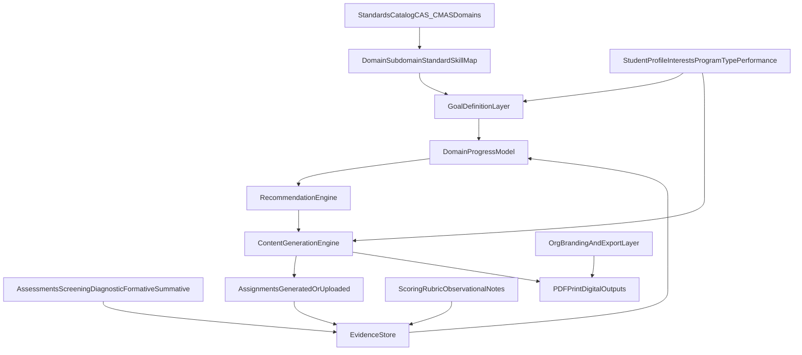

# Standards-aligned learning system initiative

Living document for delivering a standards-aligned, data-driven learning system that supports:

- Standards-informed goals
- Assessment-to-instruction feedback loops
- Personalized content generation
- Assignment and grading artifacts
- Longitudinal, domain-based progress tracking

This initiative is additive to existing Skill Builders, enrollment, guardian, provider, and learning organization workflows.

## Foundational outcome

Build a standards-aligned system that defines, tracks, and adapts student pathways over time by linking:

`standards -> goals -> assessments -> assignments -> grading -> progress -> recommendations`

This aligns to CMAS-style usage where assessment data drives instructional decisions, not score storage only.

## Scope and boundaries

### In scope

- Colorado-informed standards taxonomy (domain/subdomain/standard/skill progression)
- Goal lifecycle and measurable targets
- Evidence model for assessments and assignments
- AI generation pathways (source-based adaptation and profile-driven creation)
- Program-type behavior (tutoring, therapy/counseling, hybrid)
- Learning-org rollout controls, telemetry, and QA

### Out of scope for initial rollout

- Replacing existing module completion semantics in one cutover
- Public-facing exposure of sensitive learner evidence
- Fully autonomous recommendation execution without human review

## Existing platform anchors (reuse)

- Learning delivery/progress primitives remain active:
  - `backend/src/models/Module.model.js`
  - `backend/src/models/UserProgress.model.js`
  - `backend/src/models/QuizAttempt.model.js`
  - `backend/src/services/progressCalculation.service.js`
- Existing public and enrollment flows remain canonical:
  - `frontend/src/views/public/PublicAgencyEnrollView.vue`
  - `frontend/src/views/public/PublicProgramEnrollHubView.vue`
- Existing provider and guardian program surfaces are integration targets:
  - `frontend/src/views/skillBuilders/SkillBuildersEventPortalView.vue`
  - `frontend/src/views/guardian/GuardianPortalView.vue`

## Conceptual architecture

## Data contracts (Phase 0 and Phase 1 baseline)

### Standards taxonomy contract

Canonical hierarchy (versioned):

- `domain` (e.g., Literacy, Math, Science, SocialEmotional)
- `subdomain` or `strand` (e.g., ReadingComprehension, NumberSense)
- `standard` (external standard reference if applicable)
- `skill` (granular measurable competency)

Required metadata:

- `code`
- `title`
- `description`
- `grade_band` (or level band)
- `version`
- `source_framework` (CAS, CMAS-aligned, internal behavioral rubric)
- `is_active`

### Goal contract

Goal fields:

- `goal_id`
- `student_id`
- `program_context_id`
- `domain_id`
- `subdomain_id` (nullable)
- `standard_id` (nullable for non-standards therapy domains)
- `skill_id`
- `measurement_type` (`numeric`, `rubric`)
- `baseline_value`
- `target_value`
- `target_date`
- `start_date`
- `status` (`draft`, `active`, `achieved`, `paused`, `closed`)
- `confidence_policy` (optional)

### Evidence contract

Evidence sources:

- `assessment` (screening, diagnostic, formative, summative)
- `assignment_submission` (image, typed, instructor-entered)
- `evaluation_result` (score/rubric + observations)

Common evidence fields:

- `evidence_id`
- `student_id`
- `source_type`
- `source_id`
- `observed_at`
- `domain_id`
- `skill_id`
- `standard_id` (nullable)
- `score_value` (nullable)
- `rubric_level` (nullable)
- `completion_status`
- `notes` (nullable)
- `validity_flag`
- `reliability_flag`

### Progress snapshot contract

Per student x domain x time window:

- `snapshot_at`
- `trend_window_days`
- `mastery_estimate`
- `evidence_count`
- `goal_alignment_score`
- `recommended_next_skill`
- `recommended_difficulty_shift`

## API rollout (additive)

### Phase 1 read models (pilot-gated)

- `GET /api/learning-standards/catalog`
- `GET /api/learning-progress/students/:studentId/domains`
- `GET /api/learning-progress/students/:studentId/goals`
- `GET /api/learning-progress/students/:studentId/evidence-timeline`

### Phase 2 goal lifecycle

- `POST /api/learning-goals`
- `PATCH /api/learning-goals/:goalId`
- `POST /api/learning-goals/:goalId/activate`
- `POST /api/learning-goals/:goalId/archive`

### Phase 3 assignment and grading

- `POST /api/learning-assignments`
- `POST /api/learning-assignments/:assignmentId/submissions`
- `POST /api/learning-assignments/:assignmentId/evaluations`

### Phase 4 AI generation

- `POST /api/learning-content/generate/source-adapted`
- `POST /api/learning-content/generate/personalized`

### Phase 6 recommendations

- `GET /api/learning-recommendations/students/:studentId`

All endpoints are behind organization-level feature flags until rollout phases are complete.

## Program-type behavior model

### Tutoring (academic)

- Strong standards linkage required
- Frequent measurable checkpoints
- Numeric-heavy evidence accepted

### Therapy/counseling

- Domain model can be observational/behavioral
- Standard reference optional
- Rubric and notes weighted higher than numeric scores

### Hybrid

- Supports both standards and observational domains
- Recommendation weighting blends objective and observational evidence

## AI generation pathways

### A. Source-based generation (curriculum-aligned)

Inputs:

- Source document/artifact
- Target grade or level
- Target domain/skill/standard

System behavior:

- Adapts complexity, language, and structure while preserving intent
- Emits alignment metadata and quality checks

Output:

- Equivalent/scaffolded learning artifact
- Assignment-ready payload with standards tags

### B. Generative creation (profile + standards driven)

Inputs:

- Current inferred level
- Target skill/standard
- Interest theme
- Program constraints

System behavior:

- Generates instructional content, practice work, and assessment items
- Includes explainability metadata and guardrails

Output:

- Fully personalized, standards-linked assignment artifact

## Assignment and grading model

Each assignment entity must include:

- `assignment_id`
- linked `domain_id`, `skill_id`, `standard_id` (nullable)
- linked `goal_ids[]`
- delivery channel (`at_home`, `live_session`)
- submission mode (`image`, `typed`, `instructor_entered`)

Each evaluation result must include:

- numeric or rubric score
- completion status
- optional observation notes
- evaluator identity and timestamp

All results become evidence records and feed domain trend and goal trajectory.

## Frontend integration targets

### Guardian

- Add goals and progress summary panels in `frontend/src/views/guardian/GuardianPortalView.vue`
- Show domain trend cards and upcoming recommended focus skills

### Provider/staff

- Add goal/progress cards in `frontend/src/views/skillBuilders/SkillBuildersEventPortalView.vue`
- Integrate assignment and evidence actions in existing program/event workflow cards

### Admin and learning org setup

- Add standards and goal template management from existing admin paths
- Keep org-type gating consistent with existing learning/program/school behavior

### Public enroll and intake messaging

- When feature enabled, show concise learning-goal journey messaging in enroll/intake flows
- Reuse current routing and discovery behavior from enroll/event initiatives

## Delivery phases and exit criteria

### Phase 0 - Foundation and governance

- Finalize taxonomy, data dictionary, and reliability/validity policy
- Define feature flags and org rollout guardrails
- Exit: approved contracts and governance sign-off

### Phase 1 - Additive model and backend read APIs

- Introduce standards/goals/evidence/progress schema additively
- Ship read APIs without breaking current module completion semantics
- Exit: pilot orgs can read standards-linked progress

### Phase 2 - Goal definition and assessment loop

- Goal create/edit lifecycle with measurable baselines/targets
- Assessment ingestion updates goal trajectories
- Exit: goals update longitudinally from tagged evidence

### Phase 3 - Assignment and grading integration

- Normalize assignment entities and submission channels
- Ensure evaluation results map back to goals/domains
- Exit: assignment outcomes flow into progress models

### Phase 4 - AI generation pathways

- Implement source-adapted and personalized generation
- Require alignment metadata and pre-release validation
- Exit: generated content is standards-linked and level-calibrated

### Phase 5 - UX integration across surfaces

- Guardian/provider/admin views expose consistent progress narrative
- Public enroll/intake messaging activates by flag
- Exit: pilot org can run full loop in-product

### Phase 6 - Program intelligence and recommendations

- Infer current level from recent evidence
- Recommend next skills and difficulty shifts by program type
- Exit: auditable recommendations available to instructors

### Phase 7 - Rollout and QA

- Expand flags from pilot learning orgs to broader org network
- Run telemetry, data quality, regression, and adoption checks
- Exit: stable multi-org rollout with defined KPIs

## Rollout controls and QA checklist

- Feature flags by org type (`learning`, `program`, `school`)
- Migration runbook and rollback notes per phase
- Data quality checks (orphan tags, missing timestamps, invalid mappings)
- Reliability checks (inter-rater or rubric consistency where applicable)
- Security/privacy checks on guardian/public outputs
- Regression pass for existing Skill Builders and enrollment workflows

## KPI set

- Active goals per student/program
- Evidence freshness (days since last valid data point)
- Domain growth trend velocity
- Goal attainment rate by timeframe
- Reassessment cadence and recommendation acceptance rate
- Assignment completion and evaluation turnaround time

## Risks and mitigation

- Taxonomy drift across orgs -> versioned central catalog and migration strategy
- Evidence inconsistency -> minimum metadata contract and validation gates
- Recommendation overreach -> explainability and human approval
- Rollout disruption -> additive model first, feature-flagged rollout, no hard cutover

## Final framing statement

A standards-aligned, data-driven learning system that dynamically generates, delivers, and evaluates personalized instructional content based on continuous assessment of student performance across defined domains, enabling measurable progress tracking and adaptive goal progression over time.

## Related docs

- [Program enrollments initiative](PROGRAM_ENROLLMENTS_INITIATIVE.md)
- [Skill Builders program, school linkage, and cross-sub-organization affiliations](SKILL_BUILDERS_PROGRAM_AND_AFFILIATIONS.md)
- [Registration and guardian](REGISTRATION_AND_GUARDIAN.md)
