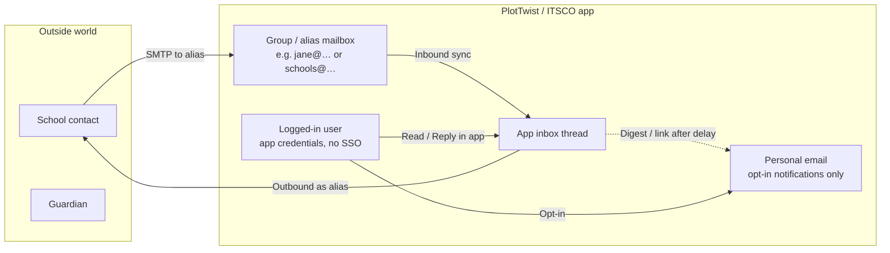

# Unified Communications Center — Product & Transition Plan

**Status:** Planning  
**Target UI:** Front / Gmail / EHR hybrid (see mockups below)  
**Related:** [`MESSAGES_AND_COMMUNICATIONS_CENTER.md`](./MESSAGES_AND_COMMUNICATIONS_CENTER.md), [`PLATFORM_EMAIL_SETUP.md`](./PLATFORM_EMAIL_SETUP.md)

---

## 1. Vision

Turn Communications Center from a **messages dashboard** into a **relationship-and-work inbox**.

Email, secure client messages, SMS, calls/voicemail, team chat, and mentions live in one place. Every conversation is anchored to **people, clients, schools, and operational work** — not just a list of messages.

**Success test:** Staff who no longer have a Google Workspace seat can do their full day of external + internal communication in the app and never ask “why would I go back to Gmail?”

### Mockup references

| Asset | What it defines |
|-------|-----------------|
| Earlier Communications Center mock (KPI strip + 3-pane + Reply/Internal Note) | Baseline unified inbox chrome |
| Updated mock (Aug 2026) — Needs Attention / Waiting / Follow Ups, inbox selector, Linked To panel, AI in composer | **Canonical target UI** |

Canonical layout:

```
┌─────────────┬──────────────────┬────────────────────────────┬─────────────────┐
│ Left rail   │ Conversation     │ Thread + composer          │ Context panel   │
│ + New Msg   │ list + filters   │ channel icons per message  │ Linked To       │
│ Inbox ▾     │                  │ Reply / Internal Note      │ Owner / Status  │
│ Channels    │                  │ AI assist · Send Later     │ Actions → EHR   │
│ Views       │                  │                            │                 │
└─────────────┴──────────────────┴────────────────────────────┴─────────────────┘
```

Top strip (high-value only — **not** 7–8 equal zero-prone counters):

| Card | Meaning |
|------|---------|
| **Needs Attention** | Needs your reply |
| **Waiting on Others** | Waiting on Them |
| **Follow Ups Due** | Due today / overdue |
| *(optional)* Assigned to You | Require your action |
| *(optional)* Response Time (7d) | Ops metric |

Channel counts live in the **sidebar**, not as top cards.

---

## 2. Design principles

1. **People first** — Open a conversation → immediately see client, guardian, school, provider, program, status.
2. **Email is a channel, not a product** — Full email behaviors inside the hub; no separate Gmail dependency for day-to-day work.
3. **Workflow over correspondence** — Owner, status, priority, due, snooze, assign, close.
4. **Shared identities** — `schools@`, `support@`, `forms@`, etc. selectable without logging into another mailbox.
5. **App-native mailboxes for non-SSO staff** — Group/alias address owned by the platform; personal email is optional notify-only.
6. **Operational actions from the thread** — Create referral, attach to client/school, task, ticket, note — without leaving the conversation.
7. **AI that knows the org** — Composer assist grounded in enrollment, referral, schedule — not generic “thanks we’ll check.”

---

## 3. Non-SSO / group mailbox model (cost + access)

### Problem

Workspace seats (~$18/user/mo) are overkill for staff who only need send/receive + chat. SSO-off users should not need an employee Gmail to work.

### Model



| Concept | Behavior |
|---------|----------|
| **Login** | App username/password (or existing non-Google auth). No Google SSO required. |
| **Mailbox identity** | Platform-managed **group or alias** the app can send/receive as (Google Group, Workspace alias on a shared mailbox, or ESP inbound + send-as). |
| **Membership** | Effectively “this user’s app inbox” — or a shared team inbox (`schools@`) with membership/roles. |
| **Directory** | Compose To: pulls **groups + people in the app** (clients, guardians, providers, school contacts, employees) plus free-typed outside emails. |
| **Personal email** | Optional. User agrees to receive notifications at personal address. Replies still go **from the group/alias**, not from personal Gmail. |
| **Personal notify cadence** | Do **not** email a “open/reply in app” link on every message. Batch or delay (configurable **24–48 hours**) unless urgency rules fire (assigned to you, Needs Reply + SLA, @mention). |
| **What they see** | Full back-and-forth in the app, same as a normal mailbox UI. |

### Cost implication

- Keep **few** real Workspace / SMTP identities (shared senders + domain reputation).
- Per-user = **alias + app seat**, not a full Google license — when Calendar/Drive/Meet are not required.

### Prerequisites / risks

- Domain SPF/DKIM/DMARC for alias sends.
- HIPAA / retention / audit for clinical content in email channels.
- Clear UX: “Sending as schools@itsco.health” always visible.
- Staff who still need Meet/Drive keep Workspace seats.

---

## 4. Channel model (unified vs email-only)

### Sidebar channels

| Channel | Icon | Source today (approx.) | Target |
|---------|------|------------------------|--------|
| All Conversations | — | Fragmented | Unified feed API |
| Email | ✉ | Tickets inbound + outbound logs | First-class email threads |
| Secure Messages | 💬 | Chat / client secure | Same |
| SMS | 📱 | Communications hub / Vonage | Same |
| Calls & Voicemail | 📞 | Existing call/voicemail | Same |
| Mentions | @ | Chat mentions | Same |
| Team Discussions | 👥 | Channels / team chat | Same |
| Shared Files | 📄 | Attachments across channels | Index + filter |

In the **unified** feed and inside **mixed threads**, show the channel icon on:

1. Each **conversation row**
2. Each **individual message** in the thread

### List filters (middle column)

`All · Needs Reply · Unread · Starred · Snoozed`  
(+ Assigned to Me / Follow-up as views in the left rail)

---

## 5. True email behaviors (parity checklist)

| Behavior | Priority | Notes |
|----------|----------|-------|
| Reply / Reply all / Forward | P0 | Thread with Message-ID / In-Reply-To / References |
| CC / BCC | P0 | Composer fields; BCC never leak to recipients |
| Attachments + drag-and-drop | P0 | Size limits; virus scan policy TBD |
| Signatures by agency or sender identity | P0 | Already partially via `EmailSenderIdentity` |
| Draft autosave | P0 | Per conversation + compose |
| Scheduled send | P1 | “Send Later” |
| Undo send | P1 | Short delay window (e.g. 10–30s) |
| Mark unread | P0 | |
| Star / pin | P0 | |
| Archive | P0 | |
| Spam / block sender | P1 | Org-level block list |
| Print / download thread | P1 | PDF or .eml |
| Full search (sender, subject, attachment name, date, keyword) | P0 | Dedicated email search index |

---

## 6. Context panel (why this beats Gmail)

When a conversation opens, the right pane is **relationship context**, not generic “details.”

### Linked To (auto + manual)

Example:

- **Client:** Jane D. — Active  
- **Guardian:** Maria D.  
- **School:** Cheyenne JH  
- **Assigned Provider:** Sarah K.  
- **Program:** Counseling  
- **Status:** Active  

Actions: **Open Client · Open School · View Schedule · Create Task · Add Note**

### Recognized contact (automatic)

If `schools@` receives mail from a known school contact:

```
Recognized contact
Cheyenne JH • School Partner
2 active referrals • 4 enrolled clients
```

Staff should not hunt the system to learn who they are talking to.

### Conversation info (workflow)

| Field | Values / behavior |
|-------|-------------------|
| Owner | Assignable user |
| Status | `New · Needs Reply · Waiting on Them · Follow Up · Resolved` |
| Priority | Low / Normal / High / Urgent |
| Due | Datetime |
| Team | e.g. School Support |
| Tags | Onboarding, Intake, … |

Buttons: **Assign · Follow Up · Close** (+ Snooze)

**Waiting on Them** is first-class — the state email users lose track of most often.

### Snooze / Follow Up

Presets: Later Today · Tomorrow · Next Week · Pick Date  

Conversation leaves the active queue and returns when due (and surfaces in **Follow Ups Due**).

### Turn email into records (without leaving the thread)

- Create Referral  
- Attach to Client  
- Attach to School  
- Create Task  
- Create Support Ticket  
- Add to Medical Record *(permission-gated)*  
- Add Contact  
- Add Internal Note  

This is the “why not Gmail?” feature set.

---

## 7. Multiple inboxes / identities

Inbox selector above the conversation list:

```
Inbox ▾
  My Inbox              ← user’s personal alias / assigned mail
  School Support        ← schools@…
  Client Support
  People Operations
  Payroll
  Compliance
  All Assigned to Me
```

- Switching inbox changes From/signature automatically (`EmailSenderIdentity`).
- Membership + ACLs decide who can read/send for each shared inbox.
- “All Assigned to Me” spans inboxes where the user is owner/assignee.

---

## 8. Compose

Prominent **+ New Message** (primary CTA).

Compose fields:

- **Send as:** identity from inbox selector  
- **To / CC / BCC**  
- **Subject**  
- Recipients resolve from:
  - Client · Guardian · Provider · School Contact · Employee · Group  
  - Outside email (typed)  

Type “Cheyenne” → known school contacts + related people.

### Privacy / safety warnings

Before send:

- **External recipient** — “This email is leaving the ITSCO system.”  
- **PHI / sensitive channel risk** — flag if protected content + inappropriate recipient/channel (policy rules).  

---

## 9. Notifications philosophy

Prefer **attention states** over raw unread:

| Signal | Example |
|--------|---------|
| Needs your reply | 7 |
| Follow-ups due | 3 |
| Assigned to you | 2 |
| Mentions | 1 |
| Waiting on others | 4 *(informational, not urgent)* |

Dashboard / Center home and optional personal-email digests should use this language.

Personal-email opt-in (non-SSO model):

- Default: **no** per-message personal mail.  
- Digest or deep-link after **24–48h** if still Needs Reply / Follow Up Due (configurable).  
- Bypass delay for: direct assignment, @mention, high priority, SLA breach.

---

## 10. AI in the composer (not a separate window)

Inline assist:

- Assist with reply / Draft response  
- Make shorter · warmer · professional  
- Summarize thread  
- What do they need from me?  
- Suggest next action  

Grounding context (permission-scoped): organization, client, referral, enrollment, scheduling status.

Long threads show a **Conversation summary** + **Next suggested action** + **Draft reply**.

**Guardrails:** No PHI in prompts beyond what the user already can see; reuse existing Note Aid–style PHI warnings where applicable; log assist usage for audit.

---

## 11. What exists today (reuse map)

| Capability | Current surface | Role in plan |
|-----------|-----------------|--------------|
| Communications Center shell | `CommunicationsCenterView.vue` | Evolve Home → attention KPIs; Messages → unified shell |
| Team chat / DMs | `MessagesWorkspace.vue` | Secure + Internal channels |
| SMS care 3-pane | `CommunicationsHubView.vue` + `ConversationThread.vue` | Layout prototype for unified panes |
| Support tickets + email source | `TicketDeskView.vue`, inbound agent | Seed for email threading / school inboxes |
| Sender identities + inbound routes | `EmailSenderIdentity`, `email_inbound_routes` | Shared inboxes + signatures |
| Unified email send | `unifiedEmailSender.service.js` | Outbound Reply / Forward |
| School inbound sync | `schoolEmailInboundSync.service.js` | Pattern for alias → app |
| Personal vs work email fields | `users.personal_email`, `work_email` | Opt-in notify target |
| Mentions, voicemail, files | Messages dashboard cards | Sidebar channel counts |
| Push / in-app notifications | Existing notification stack | Attention-based prefs |

Do **not** build a second Gmail UI in parallel — converge into one hub.

---

## 12. Phased roadmap

### Phase 0 — Stabilize & align (now)

- [x] Top-nav horizontal scroll paint bug (mask-image) fix in `App.vue`  
- [x] Lock mockup as source of truth (this doc + attached screenshots)  
- [x] Decide mailbox tech: **existing Workspace impersonation + `EmailSenderIdentity` aliases** (ESP / per-user Groups deferred to Phase 2)  

### Phase 1 — Unified shell + Email P0 *(highest ROI)*

**Focus:** Unified Inbox + Email + Shared Inboxes + Assignment/Status/Follow-up + Client/School context  

1. [x] New unified conversation list API (channel, status, owner, snooze, inbox id).  
2. [x] UI shell matching mock (left rail, list, thread, context).  
3. [x] Email thread model (headers, participants, attachments).  
4. [x] Reply / Reply all / Forward, CC/BCC, drafts, mark unread, star, archive.  
5. [x] Inbox selector wired to sender identities.  
6. [x] Status system + snooze + owner.  
7. [x] Context panel Linked To + recognized contact for school/client emails.  
8. [x] Attention KPI cards (3–5 max).  

**Shipped:** migration `1310_unified_communications_inbox.sql`; APIs under `/api/communications/{inboxes,attention-summary,conversations}`; UI `frontend/src/components/unifiedInbox/*` on Communications Center Home.  

### Phase 2 — App-native mailboxes for non-SSO staff

1. [x] Provision per-user (or per-role) group/alias.  
2. [x] App ACL: user ↔ mailbox membership.  
3. [x] Personal-email opt-in + 24–48h digest rules.  
4. [x] Directory-backed compose (people + groups).  
5. [x] External / PHI send warnings.  

**Shipped:** migration `1311_unified_inbox_phase2_personal_mailboxes.sql`; `personalMailbox.service.js`; prefs + digest job; `/directory` + `/send-preflight`; UI typeahead + confirm + My Inbox ensure.  

### Phase 3 — Operational actions + SMS/Calls parity

1. Create Referral / Attach Client / Task / Ticket / School record from thread.  
2. Bring SMS + calls/voicemail into the same list with channel icons.  
3. Print/download, spam/block, scheduled send, undo send.  

### Phase 4 — AI + search polish

1. Composer AI grounded in org/client state.  
2. Thread summary + suggested next action.  
3. Full email search (sender, subject, attachment, date, keyword).  
4. Response-time analytics card.  

### Phase 5 — Deprecate / migrate

1. Soft-migrate staff off Workspace seats where eligible.  
2. Redirect old Messages / SMS-only entry points into unified hub.  
3. Update [`MESSAGES_AND_COMMUNICATIONS_CENTER.md`](./MESSAGES_AND_COMMUNICATIONS_CENTER.md) as the short product model; keep this doc as the build plan.  

---

## 13. Data model sketch (Phase 1)

> Names illustrative — finalize in migration design.

```
communication_inboxes
  id, agency_id, identity_key, from_email, display_name, type (personal|shared), …

communication_inbox_members
  inbox_id, user_id, role (owner|member|readonly)

communication_conversations
  id, agency_id, inbox_id, channel, subject,
  status, priority, owner_user_id, due_at, snoozed_until,
  starred, archived_at, …

communication_participants
  conversation_id, kind (email|user|client|guardian|school_contact|…),
  email, display_name, linked_entity_type, linked_entity_id

communication_messages
  id, conversation_id, channel, direction, from_json, to/cc/bcc,
  body_html/text, internet_message_id, in_reply_to, sent_at,
  is_internal_note, …

communication_attachments
  message_id, filename, storage_key, …

communication_links
  conversation_id, entity_type, entity_id  -- client, school, referral, task, …

user_communication_prefs
  user_id, personal_email_notify, digest_hours (24|48), …
```

Reuse ticket/inbound tables where they already match; prefer **adapter** over big-bang rewrite.

---

## 14. Priorities (locked from product discussion)

Build first:

1. **Unified Inbox + Email**  
2. **Shared Inboxes**  
3. **Assignment / status / follow-up** (incl. Waiting on Them + Snooze)  
4. **Client / school context panel** (+ recognized contact)  
5. **AI-assisted replies** (after context exists so drafts are useful)  

In parallel track (policy + infra): **non-SSO group mailbox + personal digest delay**.

---

## 15. Open decisions

| Decision | Options | Recommendation |
|----------|---------|----------------|
| Mailbox backend | Google Groups + shared send-as · single Workspace mailbox + aliases · Mailgun/Postmark inbound | Start with **existing Workspace impersonation + aliases/groups** (already in stack); ESP if scaling inbound |
| Personal alias format | `first.last@agency…` vs opaque | Human-readable for external trust |
| Who gets app mailboxes | All non-SSO · role allowlist · opt-in | Role allowlist first (school support, ops) |
| Medical record attach | Always vs clinical roles only | Clinical roles + audit |
| Mixed threads | One conversation spanning email+SMS vs separate | Prefer **one conversation** when same linked client/school; show per-message channel icons |

---

## 16. Out of scope (for now)

- Full Google Drive / Meet replacement  
- Life Balance Wheel (deferred elsewhere)  
- Replacing school portal messaging UX (can feed into unified later)  

---

## 17. Acceptance criteria (Phase 1 done when…)

1. User opens Communications Center and sees the mock-like 3–4 pane layout.  
2. Can filter **Email** and complete Reply / Reply all with CC and attachment.  
3. Can switch **My Inbox** vs **schools@** and From/signature follow.  
4. Opening a school email shows **Linked To** / recognized school without manual search.  
5. Can set status to **Waiting on Them**, snooze until tomorrow, and see it leave Needs Attention.  
6. Top cards show attention counts, not a wall of zeros.  
7. Internal Note never sends externally.  

---

## 18. Doc maintenance

- Update this plan when phases complete (checkboxes + “Shipped” notes).  
- Keep short user-facing model in [`MESSAGES_AND_COMMUNICATIONS_CENTER.md`](./MESSAGES_AND_COMMUNICATIONS_CENTER.md).  
- Email infra credentials remain in [`PLATFORM_EMAIL_SETUP.md`](./PLATFORM_EMAIL_SETUP.md).  
