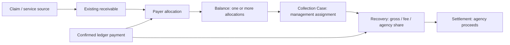

# Management company collections handoff

The implemented scope follows the clarified request: send an existing receivable and its supporting billing details to the management company for collection. The larger attached invoice, messaging, print/mail and settlement workflow remains a separate roadmap. The invoice image is a visual reference; its example contact information, QR code and payment URL are not application configuration.

## Object boundaries

`family_receivables` and `family_receivable_allocations` remain authoritative for financial responsibility and net paid amounts. `family_collection_balances` groups allocations for one originating agency, client, responsible payer and currency. Multiple dates of service and copays can share the group. Grouping does not copy an amount into a second collectible ledger. Each allocation belongs to at most one collection balance.

`family_collection_cases` records the management company, active agreement, transferred amount, fee rate, actor, timestamp and encrypted transfer packet. Transfer does not mark a claim or receivable paid, change accounting ownership, post a fee, write off debt, or move cash. The packet is immutable; the case view separately loads current outstanding amounts, payment attempts, refunds and notices. Adjustments and later payments therefore change the current view without rewriting the amount originally referred.

`family_collection_recoveries` and `family_collection_settlements` are distinct schema and domain foundations. A recovery references an already confirmed ledger payment; it does not post cash a second time. The domain rules calculate fees on actual recovery, using cumulative integer-cent rounding. A settlement groups recovery proceeds, with unique recovery membership. These constructors are pure domain rules and require trusted, authorized database records and a complete, locked recovery history from a future persistence adapter.

**Recovery posting, reversal accounting, settlement approval, ACH execution and settlement UI are not wired into production payment posting by this change.** Existing post-transfer payments still reconcile through the existing family ledger and appear in the collection case. No fee or payable is silently posted. Before connecting the financial adapters, resolve cash custody (payment to the originating agency versus payment to the manager), fee reversals, post-settlement refunds, and payout reconciliation.

## Handoff workflow

Open **Family billing → Collections → Management company collections** in the originating agency. A staff member with explicit `escalate` permission selects an active agreement, a client/payer group, eligible balance items and the payer's confirmed mailing address. The reviewed amount must still match when submitted.

The backend checks each item's age against the agreement (default 60 days), existing responsibility and insurance protections, ledger integrity, payer authorization, holds, disputes, payment plans, pending payments and existing case membership. A newer charge cannot inherit eligibility from an older charge in the same group. Source and allocation rows are locked in the payment-posting order. Duplicate request keys return the same transfer; altered requests and overlapping referrals are rejected.

The management company opens its own **Family billing → Collections** tab to see assigned cases across originating agencies. Each case includes:

- Originating and managing organization, transfer date and original referred amount.
- Payer name, account email and phone, staff-confirmed mailing address and its confirmation actor/date. Channel consent is explicitly unverified; no message is sent by a handoff.
- Client name, service dates, source references, responsibility category and verification basis where recorded, assigned amounts and payments before transfer.
- Payment attempts, confirmed payments, receipts references, refunds and recorded notices for the selected allocations.
- Current outstanding amounts and collection-blocking issues, separately from the transfer snapshot.

Payer statements can include other clients. The packet includes only matching allocation lines and notice delivery metadata, not another client's statement body. It excludes clinical notes, diagnoses, insurance payloads, card references and processor secrets. An original invoice file is not available in this ledger model and is not fabricated; service references, responsibility and financial history are supplied instead.

The agency retains case visibility. Its ordinary overdue reminder queue and automatic card collection exclude referred allocations. Disabling new handoffs or closing a case does not implicitly restart agency collection. Existing patient-initiated payment paths remain available. Reassigning the responsible payer is blocked while the allocation belongs to a case; return/reassignment needs an explicit future reconciliation workflow. Existing adjustments and refunds retain their own ledger validation and become visible on refresh.

The case list shows the most recent 200 cases; this is not a complete cross-tenant financial report. The existing agency balance picker inherits the billing desk's 500-item limit. New management-company messaging, assignment, case closure and print/mail actions are outside this handoff slice.

## Access and activation

Apply additive main migration **1494_management_collections.sql**, after the existing family billing prerequisites. New handoffs and case access require `FAMILY_COLLECTIONS_ENABLED=true`; nothing is enabled or referred by the migration. Existing referrals continue suppressing agency reminders and automatic payments if the flag is subsequently disabled.

Provision the signed relationship in `family_collection_agreements` with the actual originating and managing agency IDs, agreement reference, configured eligibility days, fee basis points (2500 = 25%) and explicit activation. No management company is inferred from an agency name. Agreement creation and permission administration have no public API in this change and must be provisioned through the existing authorized database administration process.

Grant named users permissions in `family_collection_permissions` for their own agency:

- Origin staff: `view` for case access, `escalate` to transfer.
- Management staff: `manage` for assigned case access; `financial` additionally exposes the case fee rate.
- `settlement` and `admin` reserve distinct responsibilities for later workflows. `admin` does not implicitly grant escalation or financial access.

All users also need the existing billing staff authorization for the selected organization. Provider roles remain excluded. A management user gains access only to cases explicitly assigned to that organization, not general access to the originating tenant. Case reads and transfers enter the billing audit log. Contact details at transfer are historical; collectors must verify current channel preferences before contacting the payer.

## Validation

- Pure domain tests: multi-copay grouping, aging boundaries, mixed ownership rejection, adjustments/refunds, partial recovery fees, rounding and settlement conservation.
- Disposable MySQL 8.4 integration: real migration, encrypted packet, concurrent duplicate requests, amount drift, pending-payment rejection, unchanged receivables, tenant/permission isolation, notice filtering, live payment changes, disputes and automatic-payment suppression.
- Vue tests: eligibility filtering, permission visibility, stable request reference after failure, and transfer-versus-current amounts.
- Existing family-ledger policy tests pass. The production frontend build passes with `NODE_OPTIONS=--max-old-space-size=8192 npm run build`; the default 4 GB heap was exhausted. Vite reports its existing large-bundle warning.

Run the pure tests with `node --test backend/src/services/__tests__/collectionDomain.test.js`. Run the UI tests from `frontend` with `npm test -- src/components/billing/__tests__/CollectionHandoff.test.js`.

The optional `collectionHandoff.mysql.test.js` suite recreates only the synthetic `collections_test` database on `127.0.0.1:33318`. It refuses other connection identities. Use a disposable MySQL container, `COLLECTION_HANDOFF_MYSQL_TEST=1`, `FAMILY_COLLECTIONS_ENABLED=true`, `NODE_ENV=test`, `SKIP_DB_CONNECT=1`, the synthetic credentials asserted by the test, and a synthetic 32-byte family billing encryption key. Point both main and clinical pools at that disposable database. Never run this fixture against application data.
